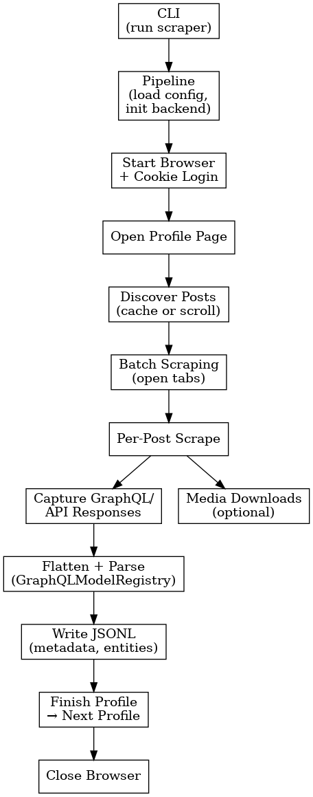
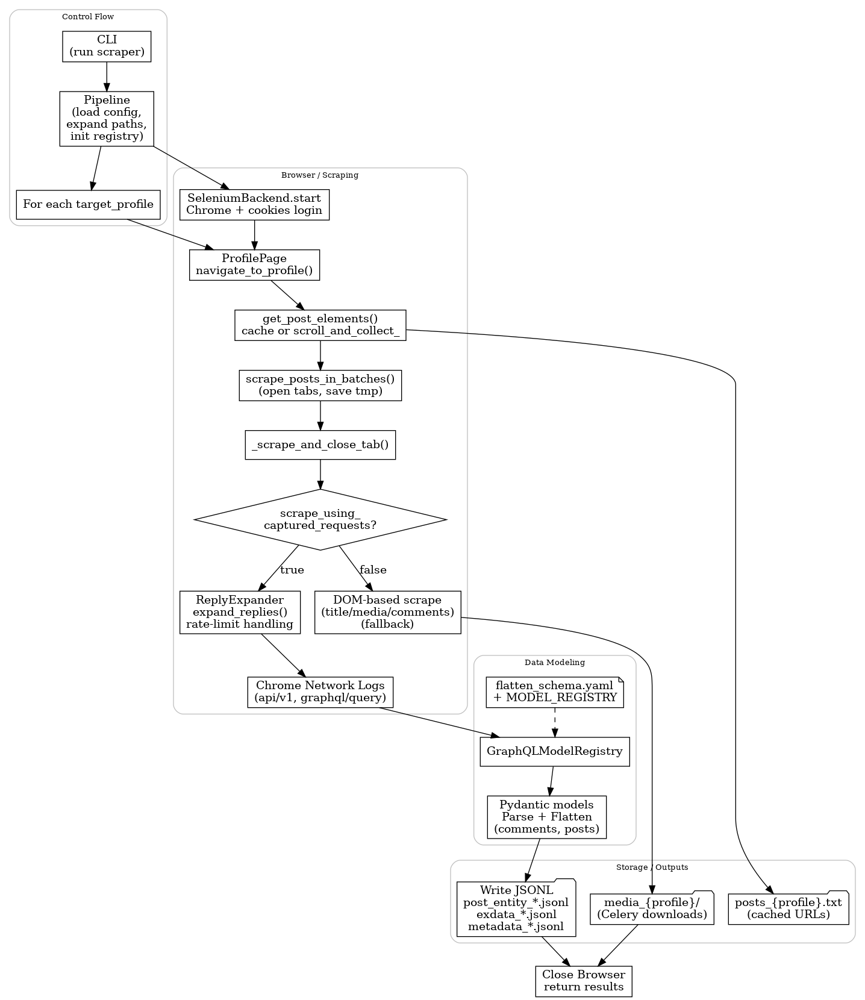
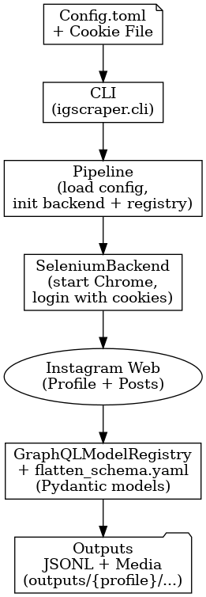

Here you go — thin README plus a PNG workflow diagram you can share with other engineers/assistants.

---

## README (thin but actually useful)

### Overview

This project is an **Instagram profile scraper** that:

* Logs into Instagram using saved cookies.
* Scrapes posts for one or more profiles (or from a URL list).
* Collects comments (via captured GraphQL/API calls) and flattens them into JSONL.
* Optionally downloads media (images/videos) to disk.
* Writes all outputs under a profile-specific folder inside `outputs/`.

Current config example (mode = 1):

```toml
[main]
mode = 1
target_profiles = [
    { name = "paulinastein", num_posts = 3 }
]
fetch_comments = true
scrape_using_captured_requests = true
headless = false
batch_size = 2
save_every = 2
```

---

### How to Run

From the repo root:

```bash
python -m igscraper.cli --config path/to/config.toml
```

Key expectations:

* `config.toml` must point to a valid `cookie_file` generated via the login helper
  (e.g. `login_Save_cookie.py`).
* `redis` is required if you are using Celery-based media downloads.
* Output directory defaults to `outputs/`.

---

### High-level Workflow

1. **CLI → Pipeline**

   * `igscraper.cli` parses `--config` and creates `Pipeline(config_path, dry_run=False)`.
   * `Pipeline.run()` loads the TOML config, expands paths, and initializes:

     * `SeleniumBackend`
     * `GraphQLModelRegistry` + `flatten_schema.yaml`.

2. **Browser startup & login**

   * `SeleniumBackend.start()`:

     * Starts Chrome with anti-detection flags, CDP logging, custom user-agent.
     * Loads cookies from `config.data.cookie_file`.
     * Navigates to `https://www.instagram.com/` and applies cookies.
     * Prepares `ProfilePage` for navigation.

3. **Profile loop (mode=1)**

   * For each `{ name, num_posts }` in `main.target_profiles`:

     * Create a profile-specific config.
     * Expand paths like:

       * `outputs/{profile}/posts_{profile}.txt`
       * `outputs/{profile}/post_entity_{profile}.jsonl`
       * `outputs/{profile}/metadata_{profile}.jsonl`
       * `outputs/{profile}/media_{profile}/`
     * `open_profile(profile_name)` → go to that IG profile.

4. **Post URL discovery**

   * `get_post_elements(limit)`:

     * Try to load cached URLs from `posts_{profile}.txt`.
     * If missing:

       * `ProfilePage.scroll_and_collect_(limit)` scrolls the grid and collects post URLs.
       * Save them to `posts_{profile}.txt` for reuse.
     * Filter out URLs already present in `metadata_{profile}.jsonl`.
   * Returns clean list of post URLs to scrape.

5. **Batch scraping (tabs)**

   * `scrape_posts_in_batches(post_urls, batch_size, save_every)`:

     * For each batch:

       * Open each post URL in a new tab via `window.open(...)`.
       * For each opened tab:

         * `_scrape_and_close_tab(...)`:

           * Switch to tab → wait for load.
           * With `scrape_using_captured_requests = true`:

             * **Only** extract comments via `_extract_comments_from_captured_requests`.
             * No DOM-based media/title scraping in this mode.
           * Close the tab and switch back to main window.
       * Periodically:

         * Append per-post results to a tmp JSONL file.
         * Every `save_every` posts:

           * `save_scrape_results(...)` → updates final JSONL files.
           * Clear tmp file.
       * Sleep a small random delay between batches for rate-limiting.

6. **Comments via captured GraphQL**

   * `_extract_comments_from_captured_requests`:

     * Find the comment container and build a `ReplyExpander`.
     * Extract initial comments embedded in HTML and persist via the registry.
     * In a loop:

       * Click “View replies” / “View more comments” in small batches.
       * Handle IG “Comments can’t be loaded” errors with exponential cooldown.
       * After each batch:

         * Registry pulls Chrome performance logs (`Network.*` events), filters:

           * `instagram.com/*api/v1*`
           * `instagram.com/*graphql/query*`
         * For each relevant response body:

           * `GraphQLModelRegistry` parses it using `flatten_schema.yaml`.
           * Comments from:

             * `xdt_api__v1__media__media_id__comments__connection`
             * `xdt_api__v1__media__media_id__comments__parent_comment_id__child_comments__connection`
           * Flattened comment data (including GIFs & user fields) is written into:

             * `post_entity_{profile}.jsonl`
             * `exdata_{profile}.jsonl` (depending on registry config).
     * Final call ensures all captured posts/comments are flushed to disk.

7. **Media downloads (optional)**

   * In non–captured-requests mode, or if media extraction is enabled:

     * `media_from_post_gpt(driver)` returns image/video metadata.
     * Video lists are handed to a Celery task:

       * `write_and_run_full_download_script_.delay(...)`.
     * Media files end up in `media_{profile}/`.

8. **Completion**

   * After all batches and profiles:

     * `SeleniumBackend.stop()` closes the browser.
     * `Pipeline.run()` returns an aggregated `all_results` dict.

---

### Outputs per Profile

Under `outputs/{profile}/` you typically get:

* `posts_{profile}.txt` – discovered post URLs.
* `metadata_{profile}.jsonl` – per-post scrape metadata / status.
* `post_entity_{profile}.jsonl` – flattened entities (posts/comments).
* `exdata_{profile}.jsonl` – additional flattened data (depending on registry).
* `graphql_keys_{profile}.jsonl` – which GraphQL keys were seen.
* `skipped_{profile}.txt` – skipped posts with reasons.
* `media_{profile}/` – downloaded media files (if enabled).

---

## Workflow Diagram (PNG)








* CLI → Pipeline → SeleniumBackend.start
* Profile loop
* Post URL discovery
* Batch tab scraping per post
* Comments via captured requests (ReplyExpander + GraphQL registry)
* JSONL + media outputs
* Final tear-down

That should be enough for any engineer or assistant to orient themselves without reading the whole codebase.
