# Slug-Ig-Crawler

[](https://github.com/shang-vikas/insta_profile_scraper/actions/workflows/ci.yml)
[](https://github.com/shang-vikas/insta_profile_scraper/stargazers)

**What it is:** A Python tool that drives a real browser (Selenium) to collect **public** Instagram profile data, post metadata, comments, and media, with optional **Google Cloud Storage** uploads and **PostgreSQL** enqueue rows for downstream pipelines. Configuration is **TOML + Pydantic**; orchestration is **CLI → Pipeline → Selenium backend**.

This document is organized so you can **understand the repo, skim flags, and run a first pass in 5–10 minutes**, then jump to the deeper sections below when you need them.

---

## Table of contents

### Start here

| # | Section |
|---|--------|
| 1 | [What this repository is](#what-this-repository-is) |
| 2 | [Objectives & scope](#objectives--scope) |
| 3 | [Features](#features) |
| 4 | [Key configuration flags](#key-configuration-flags) |
| 5 | [Installation](#installation) |
| 6 | [Quickstart (5-10 minutes)](#quickstart-5-10-minutes) |
| 7 | [Documentation map](#documentation-map) |
| 8 | [Open source, research use, and acceptable use](#open-source-research-use-and-acceptable-use) |

### Reference (deep dive)

| # | Section |
|---|--------|
| 9 | [Architecture Overview](#architecture-overview) |
| 10 | [Entry Point: CLI](#entry-point-cli) |
| 11 | [VS Code debugging (`launch.json`)](#vs-code-debugging-launchjson) |
| 12 | [Core Components](#core-components) |
| 13 | [End-to-End Workflow](#end-to-end-workflow) |
| 14 | [Execution Flow](#execution-flow) |
| 15 | [Sequence Diagram](#sequence-diagram) |
| 16 | [Configuration](#configuration) |
| 17 | [External services and infrastructure](#external-services-and-infrastructure) |
| 18 | [Data Models and Parsing](#data-models-and-parsing) |
| 19 | [Authentication](#authentication) |
| 20 | [Docker and Docker Compose](#docker-and-docker-compose) |
| 21 | [Data Persistence](#data-persistence) |
| 22 | [Key Design Patterns](#key-design-patterns) |
| 23 | [Dependencies](#dependencies) |
| 24 | [Security Considerations](#security-considerations) |
| 25 | [Troubleshooting](#troubleshooting) |
| 26 | [Performance Timing & Observability](#performance-timing--observability) |
| 27 | [Conclusion](#conclusion) |

---

## What this repository is

- **Stack:** Python 3, **Selenium** (+ **selenium-wire** for captured network traffic), **Pydantic** config, optional **GCS** and **Postgres** (`psycopg`) for artifact handoff.
- **Entry point:** `Slug-Ig-Crawler` → `Pipeline` → `SeleniumBackend` → page objects and utilities. Pass `--config /path/to/config.toml`, or omit it when `~/.slug/config.toml` exists (e.g. after `Slug-Ig-Crawler bootstrap`).
- **Outputs:** JSONL and related files under configurable paths; when `push_to_gcs = 1`, batches can be uploaded and **enqueued** (`crawled_posts` / `crawled_comments`). See `scripts/postgres_setup.sql` for the DB schema.
- **Operations note:** Job orchestrators (e.g. **Thor**) may generate configs from their own templates and run the same CLI inside Docker; this README does not replace Thor’s own docs.

---

## Objectives & scope

- Research, education, and careful automation against **public** pages.
- **Transparency** in how data is collected (browser + captured requests).
- **Traceability** via `thor_worker_id`, structured logs, and optional DB rows.

**You** are responsible for compliance with [Instagram / Meta terms](https://help.instagram.com/581066165581870), applicable law, and your own risk tolerance.

---

## Features

- **Profile mode** — scrape by handle from `[main].target_profiles`.
- **URL file mode** — scrape from a list file when `[data].urls_filepath` exists on disk (overrides profile mode).
- **Captured GraphQL** — optional `scrape_using_captured_requests` path for comment/post data via performance logs.
- **Local media + optional full-video download** — in-process script when not using captured-requests path for some media flows.
- **GCS + Postgres handoff** — upload JSONL and enqueue `gs://` URIs (or **local paths** when `push_to_gcs = 0`).
- **Screenshots → MP4** — optional `enable_screenshots` with shutdown upload (respects `push_to_gcs`).
- **Docker or local Chrome** — `use_docker`, `headless`, env overrides `CHROME_BIN` / `CHROMEDRIVER_BIN`.
- **Observability** — JSON timing events (`pipeline_total_time`, `pipeline_active_time`) and structured fields including `thor_worker_id`.

---

## Key configuration flags

These are the knobs people usually need first. Full TOML lives in **`config.example.toml`**.

| Flag / section | Role |
|----------------|------|
| **`[main].target_profiles`** | Profile mode: list of `{ name, num_posts }`. |
| **`[data].urls_filepath`** | If this path **exists**, URL-file mode wins; otherwise profile mode. |
| **`[main].scrape_using_captured_requests`** | Prefer GraphQL capture from network logs vs. heavier DOM-only flows where applicable. |
| **`[main].push_to_gcs`** | `1` = upload JSONL to GCS and store `gs://...` in DB; `0` = no GCS, enqueue **absolute local paths**; also affects screenshot video upload/cleanup. |
| **`[main].gcs_bucket_name`** | Target bucket when `push_to_gcs = 1` and upload paths run. |
| **`[main].use_docker` / `headless`** | Browser environment: container vs. local; visible vs. headless. |
| **`[main].enable_screenshots`** | Capture WebP frames and generate/upload MP4 on shutdown (see `push_to_gcs`). |
| **`[trace].thor_worker_id`** | **Required** for `Pipeline`; used in logs, enqueue, and naming. |
| **`PUGSY_PG_*` env vars** | Postgres connection for `FileEnqueuer` (see `enqueue_client.py`). |
| **`GOOGLE_APPLICATION_CREDENTIALS`** | Typical GCP auth for GCS when uploading. |

**Environment overrides for binaries:** `CHROME_BIN`, `CHROMEDRIVER_BIN` beat optional `[main].chrome_binary_path` / `chromedriver_binary_path`.

---

## Installation

**Slug-Ig-Crawler** is the project name. **PyPI package:** `slug-ig-crawler`. **CLI:** `Slug-Ig-Crawler` (import package remains **`igscraper`**).

| Install | Command |
|--------|---------|
| Latest release from PyPI | `pip install slug-ig-crawler` |
| With screenshot → MP4 helpers (`imageio`) | `pip install "slug-ig-crawler[video]"` |
| Optional JSON5 parsing in the sorter | `pip install "slug-ig-crawler[json5]"` |
| Video + JSON5 together | `pip install "slug-ig-crawler[all]"` |

After install, the **`Slug-Ig-Crawler`** console script is on your `PATH` (legacy alias `igscraper` is still provided for compatibility). Dependencies are declared in **`pyproject.toml`**.

**Chrome / ChromeDriver (macOS and Linux):** `pip` does not download browsers. After `pip install "slug-ig-crawler[all]"` (or any install), run **`Slug-Ig-Crawler bootstrap`** once to fetch **stable** Chrome for Testing + matching ChromeDriver into **`~/.slug/browser/<platform>/`** and install a sample **`~/.slug/config.toml`** if missing. Until then, the first pipeline run prints a **stderr warning** suggesting bootstrap (silence with `IGSCRAPER_SILENT_BROWSER_CACHE_WARN=1`). Inspect templates with **`Slug-Ig-Crawler show-config`**.

---

## Quickstart (5-10 minutes)

**Goal:** install dependencies, apply the Postgres schema, drop in a minimal `config.toml`, and run the CLI once.

| Step | Action |
|------|--------|
| 1 | Create and activate a virtualenv: `python3 -m venv .venv && source .venv/bin/activate` (Windows: `.venv\Scripts\activate`). |
| 2 | Install from PyPI: `pip install "slug-ig-crawler[all]"`. Then run **`Slug-Ig-Crawler bootstrap`** to cache stable Chrome + ChromeDriver and seed `~/.slug/config.toml`. |
| 3 | **Postgres (required if you use enqueue):** `psql "$YOUR_DATABASE_URL" -f scripts/postgres_setup.sql`. Set `PUGSY_PG_HOST`, `PUGSY_PG_PORT`, `PUGSY_PG_USER`, `PUGSY_PG_PASSWORD`, `PUGSY_PG_DATABASE` in `.env` or your shell. |
| 4 | Edit `~/.slug/config.toml` (or pass `--config /path/to/config.toml`). Set **`[data].cookie_file`**, **`[trace].thor_worker_id`** (any non-empty string, e.g. `local-dev`). Set **`push_to_gcs`** to `0` for a local-only trial without GCP. |
| 5 | **Profile mode:** keep `[main].target_profiles` populated and ensure **`[data].urls_filepath`** is missing or points to a file that does **not** exist. **URL mode:** one URL per line in a file; set **`[data].urls_filepath`** to that real path. |
| 6 | **Docker vs local:** `[main].use_docker = true` for Docker/Compose flows; `false` with `headless = false` for a visible local browser. See [Docker and Docker Compose](#docker-and-docker-compose). |
| 7 | Run: `Slug-Ig-Crawler` (autoloads `~/.slug/config.toml`), or `Slug-Ig-Crawler --config /path/to/config.toml`. |

**Debug in the IDE:** see [VS Code debugging (`launch.json`)](#vs-code-debugging-launchjson). For **debugpy**, start **Slug-Ig-Crawler: CLI (listen for debugger)**, then **Slug-Ig-Crawler: Attach to debugpy** so execution continues past `debugpy.wait_for_client()`.

---

## Documentation map

After the quickstart, use the **Reference** table of contents above for:

- **Architecture & flow** — diagrams and sequence for how a run is structured.
- **Configuration** — full TOML sections, placeholders, `[trace]`.
- **External services** — GCS, Postgres, path rules (`/outputs/`), `push_to_gcs` behavior.
- **Docker** — compose layout and Chrome in containers.
- **Operations** — timing logs, troubleshooting, dependencies, security notes.

---

## Development from source (git clone)

Use this only when you want to hack on code, run tests, or make local edits.

```bash
git clone https://github.com/Pugsy-Explores/Slug-IG-Crawler.git
cd Slug-IG-Crawler
python3 -m venv .venv
source .venv/bin/activate
pip install -r requirements.txt
```

This installs editable mode with dev/video/json5 extras via `requirements.txt` (`-e .[dev,video,json5]`).

---

This repository is **open source** (see the project license in the repo root). It is shared for **transparency and research**, not as an official product or service.

## Open source, research use, and acceptable use

**Research and education only (recommended).** This software is intended for **research, education, and responsible personal experimentation** (for example, understanding browser automation or studying publicly visible page structure). It is **not** presented as a tool for high-volume production scraping, commercial data harvesting, or any use that conflicts with platform rules. **You** decide how you use it; **you** are responsible for that use.

**Compliance with Instagram / Meta policies (mandatory).** Instagram and Meta impose [Terms of Use](https://help.instagram.com/581066165581870), [Community Guidelines](https://help.instagram.com/477434623621119), and other rules that apply to access, automation, and data. Automated or scripted access may be **restricted or prohibited** depending on context. You must **read, understand, and follow** the terms, policies, and technical limits that apply to your jurisdiction and use case—including any future updates Meta publishes. Do **not** use this project to circumvent security, rate limits, login walls, or other protections.

**Responsible use.** Use conservative rate limits, respect people’s privacy and intellectual property, collect and retain only what you are permitted to, and stop immediately if the platform signals that access is unwelcome. Nothing in this documentation authorizes scraping in violation of applicable law or platform terms.

**No affiliation.** This project is **not** affiliated with, endorsed by, or sponsored by Instagram, Meta, or their brands.

**Disclaimer.** The software is provided **as-is** without warranty. The authors and contributors **assume no liability** for misuse, account actions (including suspension), legal claims, or damages arising from use of this repository. **You are solely responsible** for ensuring your use is lawful and compliant.

---

## Architecture Overview

The application follows a layered architecture with clear separation of concerns:

```
┌─────────────────────────────────────────────────────────────┐
│                    CLI Layer (cli.py)                        │
│              Command-line argument parsing                   │
└──────────────────────┬──────────────────────────────────────┘
                       │
                       ▼
┌─────────────────────────────────────────────────────────────┐
│              Pipeline Layer (pipeline.py)                   │
│         Orchestrates scraping workflow                      │
└──────────────────────┬──────────────────────────────────────┘
                       │
                       ▼
┌─────────────────────────────────────────────────────────────┐
│         Configuration Layer (config.py)                      │
│    Loads and validates TOML configuration                   │
└──────────────────────┬──────────────────────────────────────┘
                       │
                       ▼
┌─────────────────────────────────────────────────────────────┐
│         Backend Layer (backends/selenium_backend.py)        │
│    Manages WebDriver lifecycle and browser automation       │
└──────────────────────┬──────────────────────────────────────┘
                       │
        ┌──────────────┴──────────────┐
        ▼                              ▼
┌──────────────────┐         ┌──────────────────────┐
│  Page Objects    │         │  Data Extraction     │
│  (pages/)        │         │  (utils.py)          │
└──────────────────┘         └──────────────────────┘
        │                              │
        └──────────────┬──────────────┘
                       ▼
┌─────────────────────────────────────────────────────────────┐
│         Data Persistence Layer                               │
│    Local files, GCS upload, database enqueueing             │
└─────────────────────────────────────────────────────────────┘
```

### Runtime mode selection

At `Pipeline.run()`, the effective mode is chosen **after** config load (the `[main].mode` value in TOML may be overwritten):

1. **URL file mode (mode 2)** — if `[data].urls_filepath` is set **and** that path exists on disk.
2. **Profile mode (mode 1)** — else if `[main].target_profiles` is non-empty.
3. Otherwise the run logs a warning and does nothing.

### Config template and Thor

- **This repo:** use `config.example.toml` as a starting point (copy to `config.toml` and edit). It includes a `[trace]` section required by `Pipeline`.
- **Thor** does not read this README; it generates job configs from its own template (e.g. `thor/assets/base_config.toml`) and invokes Docker with `DOCKER_COMPOSE_FILE` pointing at **its** compose file. The **service name** `Slug-Ig-Crawler` and the usual entrypoint `Slug-Ig-Crawler --config /job/config.toml` should stay compatible with that flow.

---

## Entry Point: CLI

### `cli.py`

The `cli.py` module serves as the **single entry point** for the application. It handles command-line argument parsing and initializes the scraping pipeline.

**Commands:**

| Command | Purpose |
|--------|---------|
| `run` (default) | Load config and run the pipeline. |
| `bootstrap` | Download stable Chrome + ChromeDriver into `~/.slug/browser/…` and copy sample config to `~/.slug/config.toml` if absent (`--force` / `--force-config` available). |
| `show-config` | Print the bundled sample TOML and whether `~/.slug/config.toml` exists. |

**Key behavior:**

- `main()` resolves the config path: explicit `--config`, else **`~/.slug/config.toml`** if present, else exits with a hint to pass `--config` or run **`bootstrap`**.
- Then instantiates `Pipeline` and calls `pipeline.run()`.

**Usage:**
```bash
Slug-Ig-Crawler --config config.toml
Slug-Ig-Crawler bootstrap
Slug-Ig-Crawler show-config
Slug-Ig-Crawler   # same as run; uses ~/.slug/config.toml when present
```

**Arguments (run):**
- `--config` (optional): Path to the TOML configuration file; omitted when `~/.slug/config.toml` exists

This document also includes a **[VS Code debugging (`launch.json`)](#vs-code-debugging-launchjson)** section below with a ready-to-paste debugger configuration for the same entry point.

---

## VS Code debugging (`launch.json`)

Use this when you open the **repository root** (the folder that contains `src/`) in VS Code or Cursor. Create **`.vscode/launch.json`** and paste the following. It sets `PYTHONPATH` to `src/` so `python -m igscraper` resolves the same way as in a shell where you exported `PYTHONPATH`, runs from `${workspaceFolder}` so relative paths in `config.toml` work, and uses the **Python** extension’s **debugpy** adapter (`"type": "debugpy"`). If your tooling only recognizes the older launch type, change every `"type": "debugpy"` to `"type": "python"`.

Adjust the `--config` argument if your TOML file is not named `config.toml` or does not live in the repo root. Select your virtual environment in the IDE **before** starting the debugger so breakpoints bind to the right interpreter.

```json
{
  "version": "0.2.0",
  "configurations": [
    {
      "name": "Slug-Ig-Crawler: CLI",
      "type": "debugpy",
      "request": "launch",
      "module": "igscraper",
      "cwd": "${workspaceFolder}",
      "args": ["--config", "config.toml"],
      "env": {
        "PYTHONPATH": "${workspaceFolder}/src"
      },
      "console": "integratedTerminal",
      "justMyCode": false
    },
    {
      "name": "Slug-Ig-Crawler: CLI (listen for debugger)",
      "type": "debugpy",
      "request": "launch",
      "module": "igscraper",
      "cwd": "${workspaceFolder}",
      "args": ["--config", "config.toml"],
      "env": {
        "PYTHONPATH": "${workspaceFolder}/src",
        "DEBUG_ATTACH": "1"
      },
      "console": "integratedTerminal",
      "justMyCode": false
    },
    {
      "name": "Slug-Ig-Crawler: Attach to debugpy",
      "type": "debugpy",
      "request": "attach",
      "connect": {
        "host": "localhost",
        "port": 5678
      },
      "pathMappings": [
        {
          "localRoot": "${workspaceFolder}",
          "remoteRoot": "${workspaceFolder}"
        }
      ],
      "justMyCode": false
    }
  ]
}
```

**Optional attach flow:** `Pipeline` can call `debugpy.listen` when `DEBUG_ATTACH=1` (see `pipeline.py`). Start **Slug-Ig-Crawler: CLI (listen for debugger)** first, then start **Slug-Ig-Crawler: Attach to debugpy** so the process unblocks and you can hit breakpoints.

---

## Core Components

### 1. Configuration Layer (`config.py`)

The configuration layer loads, validates, and processes settings from TOML files using Pydantic models.

**Key Classes:**

- **`Config`**: Main configuration container that aggregates:
  - `MainConfig`: Scraping behavior settings (mode, batch size, retries, `push_to_gcs`, `gcs_bucket_name`, etc.)
  - `DataConfig`: File paths and data storage settings
  - `LoggingConfig`: Logging configuration
  - `TraceConfig`: `thor_worker_id` and related trace fields

- **`ProfileTarget`**: Represents a single profile to scrape with `name` and `num_posts` fields

**Key Functions:**

- `load_config(path: str) -> Config`: 
  - Loads TOML file
  - Configures root logger
  - Returns validated `Config` object

- `expand_paths(section, substitutions, depth)`: 
  - Expands path placeholders (e.g., `{target_profile}`, `{date}`, `{datetime}`)
  - Resolves relative paths to absolute paths
  - Recursively processes nested configuration sections

**Configuration Structure:**
```toml
[main]
mode = 1
target_profiles = [{ name = "username", num_posts = 10 }]
headless = false
batch_size = 2
fetch_comments = true

[data]
output_dir = "outputs"
cookie_file = "cookies.pkl"
posts_path = "{output_dir}/{date}/{target_profile}/posts_{target_profile}_{datetime}.txt"
metadata_path = "{output_dir}/{date}/{target_profile}/metadata_{target_profile}.jsonl"
```

### 2. Pipeline Layer (`pipeline.py`)

The `Pipeline` class orchestrates the entire scraping workflow, managing the browser lifecycle and coordinating profile scraping.

**Key Methods:**

- **`__init__(config_path: str)`**:
  - Loads master configuration
  - Validates `[trace].thor_worker_id` (required for `Pipeline`)
  - Initializes `SeleniumBackend`
  - Creates `GraphQLModelRegistry` for parsing network responses

- **`run() -> dict`**:
  - Starts the browser via `backend.start()`
  - Determines scraping mode (URL file if `data.urls_filepath` exists, else profile list; see [Runtime mode selection](#runtime-mode-selection))
  - Iterates through target profiles, calling `_scrape_single_profile()` for each
  - Ensures browser cleanup in `finally` block

- **`_scrape_single_profile(profile_target: ProfileTarget) -> dict`**:
  - Creates profile-specific configuration copy
  - Expands path placeholders with profile name and datetime
  - Opens profile page via `backend.open_profile()`
  - Collects post URLs via `backend.get_post_elements()`
  - Scrapes posts in batches via `backend.scrape_posts_in_batches()`
  - Returns results dictionary with `scraped_posts` and `skipped_posts`

- **`_scrape_from_url_file() -> dict`**:
  - Reads URLs from configured file
  - Filters out already processed URLs
  - Scrapes remaining URLs in batches

### 3. Backend Layer (`backends/selenium_backend.py`)

The `SeleniumBackend` class implements the `Backend` abstract interface, managing WebDriver lifecycle and browser automation.

**Key Methods:**

- **`start()`**:
  - Configures Chrome options (anti-detection, performance logging)
  - Environment-aware initialization:
    - **Always:** if `CHROME_BIN` / `CHROMEDRIVER_BIN` are set, those paths are used.
    - If `use_docker=True`: otherwise falls back to the image’s pinned Linux paths; adds Docker-specific flags (`--no-sandbox`, `--disable-dev-shm-usage`, …)
    - If `use_docker=False`: otherwise **optional `[main].chrome_binary_path` / `[main].chromedriver_binary_path` → built-in macOS defaults**
  - Validates Chrome and ChromeDriver version compatibility
  - Initializes Chrome WebDriver with appropriate binary locations
  - Patches driver with `patch_driver()` for security monitoring
  - Sets up network tracking via CDP commands
  - Authenticates using cookies via `_login_with_cookies()`
  - Initializes `ProfilePage` object and `HumanScroller`

- **`stop()`**:
  - Stops screenshot worker thread
  - Quits WebDriver and closes all browser windows
  - Finalizes screenshots (if enabled): generates video, uploads to GCS, cleans up local files

- **`_login_with_cookies()`**:
  - Navigates to `https://www.instagram.com/`
  - Loads cookies from pickle file specified in config
  - Adds cookies to WebDriver session
  - Refreshes page to apply authentication

- **`open_profile(profile_handle: str)`**:
  - Delegates to `profile_page.navigate_to_profile()`

- **`get_post_elements(limit: int) -> Iterator[str]`**:
  - Attempts to load cached post URLs from `posts_path`
  - If no cache exists, calls `profile_page.scroll_and_collect_()` to scrape fresh URLs
  - Saves collected URLs to cache file
  - Filters out already processed URLs by loading from `metadata_path`
  - Returns iterator of post URL strings

- **`scrape_posts_in_batches(post_elements, batch_size, save_every, ...)`**:
  - Opens posts in batches using `open_href_in_new_tab()`
  - For each post, calls `_scrape_and_close_tab()` to extract data
  - Saves intermediate results via `save_intermediate()`
  - Periodically saves final results via `save_scrape_results()`
  - Implements rate limiting with random delays between batches

- **`_scrape_and_close_tab(post_index, post_url, tab_handle, main_window_handle, debug)`**:
  - Switches to post's tab
  - Extracts post metadata:
    - Title/header data via `get_post_title_data()`
    - Media (images/videos) via `media_from_post_gpt()` - handles carousel posts with improved robustness
    - Likes via `get_section_with_highest_likes()`
    - Comments via `scrape_comments_with_gif()` or `_extract_comments_from_captured_requests()`
  - Handles errors gracefully, returning error dictionaries
  - Ensures tab closure and window switching in `finally` block

- **`_finalize_screenshots()`**:
  - Shutdown-time artifact finalization (runs after browser shutdown, before process exit)
  - Generates MP4 video from all `.webp` screenshots in `shot_dir` (2.5 FPS, 640p height)
  - Uploads video to GCS bucket at `gs://{bucket}/vid_log/{video_name}.mp4`
  - Deletes all local screenshots and video file after successful upload
  - Works for both PROFILE (mode 1) and POST (mode 2) jobs
  - Errors are logged but don't block shutdown

- **`_extract_comments_from_captured_requests(driver, config, batch_scrolls)`**:
  - Uses `ReplyExpander` to expand comment threads
  - Captures GraphQL network requests via `capture_instagram_requests()`
  - Parses responses using `GraphQLModelRegistry`
  - Handles rate limiting with exponential backoff
  - Saves parsed comment data to `post_entity_path`

- **`open_href_in_new_tab(href, tab_open_retries)`**:
  - Executes JavaScript to open URL in new tab
  - Waits for new window handle to appear
  - Returns the new window handle

### 4. Page Objects (`pages/`)

Page objects encapsulate page-specific interactions using the Page Object Model pattern.

#### `base_page.py`

Base class providing common WebDriver operations:

- `find(locator)`: Waits for and returns a single element
- `find_all(locator)`: Waits for and returns all matching elements
- `click(element)`: Clicks element using JavaScript
- `scroll_into_view(element)`: Scrolls element into viewport

#### `profile_page.py`

Handles Instagram profile page interactions:

- **`navigate_to_profile(handle: str)`**:
  - Constructs profile URL: `https://www.instagram.com/{handle}/`
  - Navigates to URL
  - Waits for page sections to load

- **`get_visible_post_elements() -> List[WebElement]`**:
  - Finds post container elements using XPath
  - Extracts all `<a>` tags containing post links
  - Returns list of WebElement objects

- **`scroll_and_collect_(limit: int) -> tuple[bool, List[str]]`**:
  - Scrolls profile page using `HumanScroller`
  - Collects unique post URLs from visible elements
  - Periodically captures GraphQL data via `registry.get_posts_data()`
  - Stops when limit reached or no new posts loaded
  - Returns tuple: `(is_data_saved, list_of_urls)`

- **`extract_comments(steps)`**:
  - Delegates to `scrape_comments_with_gif()` utility function

### 5. Data Extraction and Parsing

#### GraphQL Model Registry (`models/registry_parser.py`)

The `GraphQLModelRegistry` class parses GraphQL API responses captured from network requests.

**Key Methods:**

- **`__init__(registry, schema_path)`**:
  - Initializes model registry mapping patterns to Pydantic models
  - Loads flatten schema from YAML file

- **`get_posts_data(config, data_keys, data_type)`**:
  - Captures network requests via `capture_instagram_requests()`
  - Filters GraphQL responses matching `data_keys`
  - Parses responses using registered models
  - Flattens data according to schema rules
  - Saves parsed results to configured paths
  - Returns boolean indicating if data was saved

- **`parse_responses(extracted, selected_data_keys, driver)`**:
  - Parses list of captured network responses
  - Matches data keys to registered models
  - Validates and structures data using Pydantic models
  - Returns list of parsed results with flattened data

#### Utility Functions (`utils.py`)

Key extraction utilities:

- **`capture_instagram_requests(driver, limit)`**:
  - Retrieves Chrome performance logs
  - Filters requests containing `api/v1` or `graphql/query`
  - Fetches response bodies via CDP `Network.getResponseBody`
  - Returns list of `{requestId, url, request, response}` dictionaries

- **`scrape_comments_with_gif(driver, config)`**:
  - Scrolls comment section
  - Extracts comment text, author, likes, timestamps
  - Captures GIF/image URLs from comments
  - Returns list of comment dictionaries

- **`media_from_post_gpt(driver)`**:
  - Extracts image URLs and video URLs from post
  - Returns tuple: `(images_data, video_data_list, img_vid_map)`

- **`get_section_with_highest_likes(driver)`**:
  - Finds like count element using DOM traversal
  - Returns dictionary with `likesNumber` and `likesText`

- **`media_from_post_gpt(driver)`**:
  - Robust media extraction function that handles carousel posts
  - Returns tuple: `(images_list, videos_list, img_vid_map)`
  - Uses improved selectors that don't rely on fragile Instagram class names
  - Includes fallback mechanisms for single-image posts
  - Handles video extraction with proper curl command generation
  - Includes safety caps to prevent infinite loops in carousel navigation

- **`save_intermediate(post_data, tmp_file)`**:
  - Appends post data as JSON line to temporary file

- **`save_scrape_results(results, output_dir, config)`**:
  - Writes scraped posts to `metadata_path` as JSONL
  - Writes skipped posts to `skipped_path`
  - Clears temporary file

### 6. Data Persistence

#### Local File Storage

Data is saved to local files in JSONL format:

- **`metadata_path`**: Main output file with scraped post data
- **`skipped_path`**: Log of posts that failed to scrape
- **`tmp_path`**: Temporary file for intermediate results
- **`post_entity_path`**: Parsed GraphQL entities (comments, posts)
- **`profile_path`**: Profile page GraphQL data

#### Cloud Storage and Enqueueing (`services/upload_enqueue.py`)

The `UploadAndEnqueue` class handles cloud storage and database integration:

- **`upload_and_enqueue(local_path, kind, ...)`**:
  - Optionally sorts JSONL file by timestamp
  - Uploads file to Google Cloud Storage (GCS)
  - Enqueues GCS URI to PostgreSQL database via `FileEnqueuer`
  - Returns GCS URI string

**Integration Points:**

- **`on_posts_batch_ready(local_jsonl_path)`**: Called when profile data is ready
- **`on_comments_batch_ready(local_jsonl_path)`**: Called when comment data is ready

### 7. Authentication (`login_Save_cookie.py`)

Standalone script for generating authentication cookies:

- Opens Chrome browser to Instagram login page
- Waits for user to manually log in
- Saves cookies to pickle file: `cookies_{timestamp}.pkl`
- Cookie file is referenced in `config.toml` for subsequent runs

---

## End-to-End Workflow

### High-Level Flow

1. **CLI Invocation**: User runs `Slug-Ig-Crawler --config config.toml`
2. **Configuration Loading**: `Pipeline` loads and validates TOML configuration
3. **Browser Initialization**: `SeleniumBackend.start()` initializes Chrome WebDriver
4. **Authentication**: Cookies are loaded and applied to browser session
5. **Profile Iteration**: For each target profile:
   - Profile page is opened
   - Post URLs are collected (from cache or fresh scrape)
   - Posts are scraped in batches
6. **Data Extraction**: For each post:
   - Post metadata is extracted (title, media, likes)
   - Comments are collected (via DOM scraping or GraphQL capture)
   - Data is saved to local files
7. **Cloud Upload**: Completed data files are uploaded to GCS and enqueued
8. **Browser Shutdown**: WebDriver is closed in `finally` block

### Detailed Step-by-Step Execution

#### Phase 1: Initialization

1. **CLI (`cli.py`)**
   - `main()` parses `--config` argument
   - Instantiates `Pipeline(config_path)`

2. **Pipeline (`pipeline.py`)**
   - `__init__()` calls `load_config(config_path)` and validates `[trace].thor_worker_id`
   - Creates `SeleniumBackend(self.master_config)`
   - Initializes `GraphQLModelRegistry` with model registry and schema path

3. **Configuration (`config.py`)**
   - `load_config()` reads TOML file
   - Configures root logger with level and directory
   - Returns `Config` object with nested Pydantic models

4. **Backend Initialization (`selenium_backend.py`)**
   - `Pipeline.run()` calls `backend.start()`
   - Chrome options configured (headless, anti-detection, performance logging)
   - WebDriver binaries resolved with env overrides, then Docker image paths or local config/defaults
   - Driver patched with `patch_driver()` for security monitoring
   - Network tracking enabled via CDP commands
   - `_login_with_cookies()` loads and applies authentication cookies
   - `ProfilePage` object created

#### Phase 2: Profile Scraping

5. **Profile Navigation**
   - `Pipeline._scrape_single_profile()` creates profile-specific config
   - Paths expanded with `{target_profile}`, `{date}`, `{datetime}` placeholders
   - `backend.open_profile(profile_name)` navigates to profile page
   - `ProfilePage.navigate_to_profile()` constructs URL and waits for sections

6. **Post URL Collection**
   - `backend.get_post_elements(limit)` called
   - Attempts to load cached URLs from `posts_path`
   - If no cache: `profile_page.scroll_and_collect_(limit)`:
     - Scrolls page using `HumanScroller`
     - Collects visible post elements
     - Extracts `href` attributes
     - Periodically captures GraphQL data via `registry.get_posts_data()`
     - Saves URLs to cache file
   - Filters out processed URLs by loading from `metadata_path`
   - Returns iterator of post URL strings

7. **Batch Scraping**
   - `backend.scrape_posts_in_batches()` called with post URLs
   - For each batch:
     - Opens posts in new tabs via `open_href_in_new_tab()`
     - For each post tab:
       - Switches to tab
       - Calls `_scrape_and_close_tab()`:
         - Extracts title via `get_post_title_data()`
         - Extracts media via `media_from_post_gpt()`
         - Extracts likes via `get_section_with_highest_likes()`
         - Extracts comments:
           - If `scrape_using_captured_requests=True`: `_extract_comments_from_captured_requests()`
           - Otherwise: `scrape_comments_with_gif()`
       - Saves intermediate result to `tmp_path`
       - Closes tab and switches back
     - After `save_every` posts: `save_scrape_results()` writes to `metadata_path`
     - Random delay between batches for rate limiting

#### Phase 3: Comment Extraction (GraphQL Mode)

8. **Comment Thread Expansion** (if `fetch_replies=True`)
   - `ReplyExpander` clicks "View replies" buttons
   - Scrolls comment section to load more comments
   - Detects rate limiting via `_handle_comment_load_error()`

9. **Network Request Capture**
   - `capture_instagram_requests()` retrieves Chrome performance logs
   - Filters GraphQL requests matching `post_page_data_key`
   - Fetches response bodies via CDP

10. **Data Parsing**
    - `registry.get_posts_data()` calls `parse_responses()`
    - Matches data keys to registered Pydantic models
    - Validates and structures data
    - Flattens according to schema rules
    - Saves to `post_entity_path` as JSONL

11. **Cloud Upload**
    - `on_comments_batch_ready()` called with `post_entity_path`
    - `UploadAndEnqueue.upload_and_enqueue()`:
      - Sorts JSONL file by timestamp
      - Uploads to GCS bucket
      - Enqueues GCS URI to PostgreSQL

#### Phase 4: Cleanup

12. **Browser Shutdown**
    - `Pipeline.run()` `finally` block calls `backend.stop()`
    - `SeleniumBackend.stop()`:
      - Stops screenshot worker thread
      - Calls `driver.quit()` to close browser
      - If `enable_screenshots=True`: calls `_finalize_screenshots()`:
        - Generates MP4 video from all screenshots (2.5 FPS, 640p height)
        - Uploads video to GCS at `gs://{bucket}/vid_log/{video_name}.mp4`
        - Deletes all local screenshots and video file
    - All browser windows closed

---

## Sequence Diagram

The following Mermaid diagram illustrates the runtime interaction between major components:

```mermaid
sequenceDiagram
    participant User
    participant CLI as cli.py
    participant Pipeline as pipeline.py
    participant Config as config.py
    participant Backend as selenium_backend.py
    participant WebDriver as Selenium WebDriver
    participant ProfilePage as profile_page.py
    participant Registry as registry_parser.py
    participant Utils as utils.py
    participant Uploader as upload_enqueue.py

    User->>CLI: Slug-Ig-Crawler --config config.toml
    CLI->>Pipeline: Pipeline(config_path)
    Pipeline->>Config: load_config(config_path)
    Config-->>Pipeline: Config object
    Pipeline->>Backend: SeleniumBackend(config)
    Pipeline->>Registry: GraphQLModelRegistry(registry, schema_path)
    
    Pipeline->>Backend: start()
    Backend->>WebDriver: Initialize Chrome WebDriver
    Backend->>WebDriver: Configure options (anti-detection, logging)
    Backend->>WebDriver: patch_driver() for security
    Backend->>WebDriver: setup_network() via CDP
    Backend->>WebDriver: Navigate to instagram.com
    Backend->>Backend: _login_with_cookies()
    Backend->>WebDriver: Load cookies from file
    Backend->>WebDriver: Refresh page
    Backend->>ProfilePage: ProfilePage(driver, config)
    Backend-->>Pipeline: Browser ready

    loop For each target profile
        Pipeline->>Pipeline: _scrape_single_profile(profile_target)
        Pipeline->>Pipeline: Create profile-specific config
        Pipeline->>Pipeline: expand_paths() with substitutions
        Pipeline->>Backend: open_profile(profile_name)
        Backend->>ProfilePage: navigate_to_profile(handle)
        ProfilePage->>WebDriver: Navigate to /{handle}/
        ProfilePage->>WebDriver: wait_for_sections()
        
        Pipeline->>Backend: get_post_elements(limit)
        alt Cache exists
            Backend->>Backend: _load_cached_urls(posts_path)
        else No cache
            Backend->>ProfilePage: scroll_and_collect_(limit)
            loop Scroll and collect
                ProfilePage->>WebDriver: get_visible_post_elements()
                ProfilePage->>WebDriver: Scroll page
                ProfilePage->>Registry: get_posts_data(profile_page_data_key)
                Registry->>Utils: capture_instagram_requests()
                Utils->>WebDriver: get_log("performance")
                Utils-->>Registry: Network requests
                Registry->>Registry: parse_responses()
                Registry-->>ProfilePage: Data saved
            end
            Backend->>Backend: _save_urls(profile, urls, posts_path)
        end
        Backend->>Backend: _load_processed_urls(metadata_path)
        Backend-->>Pipeline: Iterator of post URLs

        Pipeline->>Backend: scrape_posts_in_batches(post_urls, batch_size)
        
        loop For each batch
            loop For each post in batch
                Backend->>Backend: open_href_in_new_tab(href)
                Backend->>WebDriver: execute_script("window.open(...)")
                Backend->>WebDriver: Wait for new window handle
                
                Backend->>Backend: _scrape_and_close_tab(...)
                Backend->>WebDriver: switch_to.window(tab_handle)
                Backend->>WebDriver: Refresh page
                
                alt scrape_using_captured_requests=True
                    Backend->>Backend: _extract_comments_from_captured_requests()
                    Backend->>Utils: find_comment_container(driver)
                    Backend->>Backend: ReplyExpander.expand_replies()
                    Backend->>Registry: get_posts_data(post_page_data_key)
                    Registry->>Utils: capture_instagram_requests()
                    Utils->>WebDriver: get_log("performance")
                    Utils-->>Registry: GraphQL responses
                    Registry->>Registry: parse_responses()
                    Registry->>Registry: Save to post_entity_path
                    Registry-->>Backend: Comments extracted
                    Backend->>Uploader: on_comments_batch_ready(post_entity_path)
                    Uploader->>Uploader: upload_and_enqueue(kind="comment")
                    Uploader->>Uploader: Sort JSONL file
                    Uploader->>Uploader: Upload to GCS
                    Uploader->>Uploader: Enqueue to PostgreSQL
                else Traditional scraping
                    Backend->>Utils: get_post_title_data(handle_slug)
                    Backend->>Utils: media_from_post_gpt(driver)
                    Backend->>Utils: get_section_with_highest_likes(driver)
                    Backend->>Utils: scrape_comments_with_gif(driver, config)
                end
                
                Backend->>Utils: save_intermediate(post_data, tmp_path)
                Backend->>WebDriver: close() tab
                Backend->>WebDriver: switch_to.window(main_handle)
            end
            
            alt save_every posts reached
                Backend->>Utils: save_scrape_results(results, output_dir, config)
                Utils->>Utils: Write to metadata_path
                Utils->>Utils: Write to skipped_path
                Utils->>Utils: clear_tmp_file(tmp_path)
            end
            
            Backend->>Backend: random_delay() between batches
        end
    end

    Pipeline->>Backend: stop()
    Backend->>Backend: Stop screenshot worker
    Backend->>WebDriver: quit()
    WebDriver-->>Backend: Browser closed
    alt enable_screenshots = true
        Backend->>Backend: _finalize_screenshots()
        Backend->>Backend: Generate video from screenshots
        Backend->>Uploader: Upload video to GCS (vid_log/)
        Backend->>Backend: Cleanup local screenshots and video
    end
    Backend-->>Pipeline: Cleanup complete
    Pipeline-->>CLI: Results dictionary
    CLI-->>User: Scraping complete
```



---

## Configuration

### Trace (`[trace]`)

`Pipeline` requires a non-empty **`[trace].thor_worker_id`** in the config file used for a full run. It is used for structured logs, enqueue metadata, and Chrome profile suffixing. Orchestrators typically inject a job-specific id.

### Configuration File Structure

The application uses TOML configuration files with the following structure:

```toml
[main]
mode = 1  # May be overwritten at runtime; see "Runtime mode selection"
target_profiles = [
    { name = "username1", num_posts = 10 },
    { name = "username2", num_posts = 5 }
]
headless = false
enable_screenshots = false  # Set to true to enable screenshot capture and video generation
use_docker = false  # Set to true when running in Docker
batch_size = 2
fetch_comments = true
fetch_replies = true
max_comments = 130
scrape_using_captured_requests = true
rate_limit_seconds_min = 2
rate_limit_seconds_max = 4
max_retries = 3
save_every = 2
gcs_bucket_name = "pugsy_ai_crawled_data"  # GCS bucket for video uploads (automatically sanitized if path-like)
consumer_id = "default_consumer"  # Consumer ID for video naming (automatically sanitized)

[data]
output_dir = "outputs"
shot_dir = "{output_dir}/{date}/screens"  # Screenshot directory (used for video generation)
cookie_file = "src/igscraper/cookies_1234567890.pkl"
posts_path = "{output_dir}/{date}/{target_profile}/posts_{target_profile}_{datetime}.txt"
metadata_path = "{output_dir}/{date}/{target_profile}/metadata_{target_profile}.jsonl"
post_entity_path = "{output_dir}/{date}/{target_profile}/post_entity_{target_profile}_{datetime}.jsonl"
profile_path = "{output_dir}/{date}/{target_profile}/profile_data_{target_profile}_{datetime}.jsonl"
schema_path = "src/igscraper/flatten_schema.yaml"
post_page_data_key = [
    "xdt_api__v1__media__media_id__comments__connection",
    "xdt_api__v1__media__media_id__comments__parent_comment_id__child_comments__connection"
]
profile_page_data_key = ["xdt_api__v1__feed__user_timeline_graphql_connection"]

[logging]
level = "DEBUG"
log_dir = "outputs/logs"
log_format = "%(asctime)s [%(levelname)s/%(processName)s] %(name)s: %(message)s"
date_format = "%Y-%m-%d %H:%M:%S"

[trace]
thor_worker_id = "your-worker-or-job-id"
```

A full sanitized template is **`config.example.toml`** in the repository root.

### Path Placeholders

Path strings support the following placeholders that are automatically expanded:

- `{output_dir}`: Base output directory
- `{target_profile}`: Current profile name
- `{date}`: Current date in `YYYYMMDD` format
- `{datetime}`: Current datetime in `YYYYMMDD_HHMM` format

---

## External services and infrastructure

This section lists **outbound** integrations (cloud, database, HTTP) and what is **required by the config schema** vs **required only when a code path runs**.

### Required TOML sections

`load_config` validates a **`Config`** with **`[main]`**, **`[data]`**, **`[logging]`**, and **`[trace]`** only. There is no message queue or broker section.

### Instagram and the browser (always for scraping)

| Item | Purpose |
|------|--------|
| **HTTPS to `instagram.com` (and related CDN domains)** | Selenium drives a real browser; there is **no** separate Instagram API key. Session auth uses **`[data].cookie_file`** (JSON cookies on disk). |
| **GraphQL / XHR data** | Parsed from **Chrome performance logs** (captured requests), not from a standalone HTTP client to a documented public API. |

### Google Cloud Storage (when upload paths run)

`SeleniumBackend` constructs `google.cloud.storage.Client()` and uses **`[main].gcs_bucket_name`** for:

- **`UploadAndEnqueue.upload_and_enqueue`** — uploads JSONL artifacts and enqueues (see PostgreSQL below). Triggered from `on_posts_batch_ready` / `on_comments_batch_ready` when those batches complete.
- **`upload_video_to_gcs`** — when `enable_screenshots` is true, uploads the shutdown MP4 to the same bucket under `vid_log/`.

**Setup:** Application Default Credentials, or **`GOOGLE_APPLICATION_CREDENTIALS`** pointing to a service account JSON with **write** access to the configured bucket. Without valid credentials, these steps fail when executed.

**Path rule:** `services/upload_enqueue.py` builds object names from local paths that contain the marker **`/outputs/`** (default `GcsUploadConfig.outputs_marker`). Typical layouts use something like `.../outputs/<date>/...` so uploads resolve correctly.

### PostgreSQL (when enqueue runs)

`igscraper/services/enqueue_client.py` **`FileEnqueuer`** inserts rows after a successful GCS upload, using **`psycopg`** with DSN from environment (optional `.env` via `dotenv`; override dotenv path with **`ENV_FILE`**):

| Variable | Role (defaults in code) |
|----------|-------------------------|
| `PUGSY_PG_HOST` | Host (`localhost`) |
| `PUGSY_PG_PORT` | Port (`5433`) |
| `PUGSY_PG_USER` | User (`postgres`) |
| `PUGSY_PG_PASSWORD` | Password (empty default) |
| `PUGSY_PG_DATABASE` | Database name (empty default — set for real use) |

Tables: **`crawled_posts`** and **`crawled_comments`** (see docstring in `enqueue_client.py` for expected columns, including **`thor_worker_id`**).

### Full-video download script (in-process)

When `scrape_using_captured_requests` is false and DOM media extraction yields videos, `services/full_media_download_script.py` **`write_and_run_full_download_script`** runs **in the same process** as the pipeline (writes a bash script under the media path and optionally executes it). No Redis, Celery, or separate worker is used.

### Other HTTP (`requests`)

Helpers in `utils.py` / `downloader.py` may use **`requests`** for ancillary downloads (e.g. media URLs). Those are **not** separate “API accounts”; they use normal HTTPS when those code paths run.

---

## Data Models and Parsing

### GraphQL Model Registry

The application uses a registry-based approach to parse GraphQL API responses:

1. **Model Registration**: Pydantic models are registered with regex patterns matching GraphQL data keys
2. **Network Capture**: Chrome performance logs are captured to extract GraphQL responses
3. **Pattern Matching**: Data keys are matched against registered patterns
4. **Validation**: Responses are validated and structured using Pydantic models
5. **Flattening**: Data is flattened according to schema rules defined in `flatten_schema.yaml`

### Flatten Schema

The `flatten_schema.yaml` file defines rules for extracting and flattening nested GraphQL data structures. It specifies:

- Which keys to extract from responses
- How to flatten nested objects
- Field mappings and transformations

---

## Authentication

### Cookie Generation

Before running the scraper, authentication cookies must be generated:

1. Run `python src/igscraper/login_Save_cookie.py`
2. A Chrome browser window opens to Instagram login page
3. Manually log in to your Instagram account
4. Press Enter in the terminal
5. Cookies are saved to `src/igscraper/cookies_{timestamp}.pkl`

### Cookie Usage

During scraping:

1. `SeleniumBackend.start()` calls `_login_with_cookies()`
2. Browser navigates to `https://www.instagram.com/`
3. Cookies are loaded from the pickle file
4. Cookies are added to the WebDriver session
5. Page is refreshed to apply authentication

---

## Docker and Docker Compose

The scraper supports running in Docker containers, providing a consistent environment across different platforms and simplifying deployment.

### Docker Support

Docker support is controlled via the `use_docker` configuration option in `config.toml`:

```toml
[main]
use_docker = true  # Set to true when running in Docker
```

When `use_docker=True`, the backend:
- Uses `CHROME_BIN` / `CHROMEDRIVER_BIN` when set; otherwise the same pinned paths as the `Dockerfile` (`/opt/chrome-linux64/chrome`, `/opt/chromedriver-linux64/chromedriver`)
- Applies Docker-specific Chrome flags: `--no-sandbox`, `--disable-dev-shm-usage`, `--disable-gpu`
- Uses `/tmp/chrome-profile` as the Chrome user data directory (can be overridden via `IGSCRAPER_CHROME_PROFILE` env var)
- Configures platform identity as "Linux x86_64"

### Dockerfile

The project includes a `Dockerfile` that:
- Uses Python 3.10 slim base image
- Installs Chrome for Testing (version-locked to 143.0.7499.170) and matching ChromeDriver
- Installs all Python dependencies from `requirements.txt`
- Sets up environment variables for Chrome binaries
- Includes version validation to ensure Chrome and ChromeDriver major versions match

**Key Dockerfile Features:**
- Version-locked Chrome installation for reproducibility
- Hard assertion that Chrome and ChromeDriver major versions match
- Proper Chrome runtime dependencies installed
- Optimized for Linux x86_64 platform

### Docker Compose

The repository includes a **canonical** `docker-compose.yml` (service name **`Slug-Ig-Crawler`**, image built from this `Dockerfile`) for local and manual runs. **Thor and other orchestrators do not ship this file**; they use whatever path is in **`DOCKER_COMPOSE_FILE`** and typically run one-off jobs like:

```bash
docker compose -f /path/to/compose.yml run --rm -v "$WORKSPACE:/job" Slug-Ig-Crawler \
  Slug-Ig-Crawler --config /job/config.toml
```

The compose file in this repo sets `PYTHONPATH`, `CHROME_BIN`, `CHROMEDRIVER_BIN`, and `shm_size: 2gb` to match the image. Optional host-specific variables (GCS credentials, etc.) can be passed with `-e` or via a local `.env` (see `.env.example`; use e.g. `docker compose --env-file .env …` if you add one).

**Usage (examples):**

```bash
docker compose build
docker compose run --rm Slug-Ig-Crawler Slug-Ig-Crawler --config config.toml
```

**Prerequisites:**
- Docker and Docker Compose installed
- Valid `config.toml` with `use_docker = true` for in-container runs
- For GCS upload from the container, mount credentials and set `GOOGLE_APPLICATION_CREDENTIALS` as appropriate

**Important Notes:**
- The Chrome profile directory defaults to `/tmp/chrome-profile` (RAM-mounted on remote servers) and is automatically created if it doesn't exist. Can be overridden via `IGSCRAPER_CHROME_PROFILE` environment variable.
- Shared memory size (`shm_size`) in compose is set to reduce Chrome crashes in containers

---

## Data Persistence

### Local Storage

Data is persisted to local files in JSONL (JSON Lines) format:

- **Metadata File**: Contains complete post data including title, media, likes, comments
- **Skipped File**: Logs posts that failed to scrape with error reasons
- **Post Entity File**: Parsed GraphQL entities (comments, replies) with flattened structure
- **Profile File**: Profile page GraphQL data

### Cloud Storage Integration

Completed data files are automatically:

1. **Sorted**: JSONL files are sorted by timestamp (optional)
2. **Uploaded**: Files are uploaded to Google Cloud Storage (GCS)
3. **Enqueued**: GCS URIs are enqueued to PostgreSQL database for downstream processing

### Screenshot Video Finalization

When `enable_screenshots = true` in configuration, the scraper automatically:

1. **Captures Screenshots**: Takes periodic screenshots (every 7 seconds) during scraping, saved as `.webp` files in `shot_dir`
2. **Generates Video**: At shutdown, converts all screenshots into a single MP4 video:
   - **FPS**: 2.5 frames per second
   - **Resolution**: 640p height (width auto-scaled to preserve aspect ratio)
   - **Format**: MP4 (H.264 codec)
   - **Location**: Generated in-place in the screenshot directory
3. **Uploads to GCS**: Video is uploaded to `gs://{bucket}/vid_log/{video_name}.mp4`
   - **PROFILE mode**: `profile_{consumer_id}_{profile_name}_{timestamp}.mp4`
   - **POST mode**: `post_{consumer_id}_{run_name}_{timestamp}.mp4`
   - **Bucket Name Validation**: The bucket name is automatically sanitized and validated:
     - Handles path-like bucket names (e.g., `/app/pugsy_ai_crawled_data` → `pugsy_ai_crawled_data`)
     - Removes `gs://` prefix if present
     - Validates GCS bucket name format (must start/end with letter/number, 3-63 chars)
     - Works correctly in both local and Docker environments
4. **Cleans Up**: After successful upload (or on failure), all local screenshots and the video file are deleted

**Requirements:**
- At least 2 screenshots must exist (otherwise video generation is skipped)
- `gcs_bucket_name` must be configured in `config.toml`
- Video finalization runs automatically during shutdown (no manual intervention needed)

**Configuration:**
- **Bucket Name**: Can be specified as:
  - Simple name: `gcs_bucket_name = "pugsy_ai_crawled_data"`
  - With `gs://` prefix: `gcs_bucket_name = "gs://pugsy_ai_crawled_data"` (prefix is automatically removed)
  - Path-like values are handled: If the config value looks like a path (e.g., `/app/pugsy_ai_crawled_data`), the basename is extracted automatically
- **Consumer ID**: Used in video filename for identification
- **Profile/Run Names**: Automatically sanitized to remove invalid filename characters

**Error Handling:**
- Video generation failures are logged but don't block shutdown
- GCS upload failures are logged but cleanup still runs
- Missing configuration fields result in skipped video generation (with warnings)
- Invalid bucket names are validated and sanitized automatically, with clear error messages if sanitization fails

### File Formats

**Metadata JSONL Format:**
```json
{
  "post_url": "https://www.instagram.com/p/ABC123/",
  "post_id": "post_0",
  "post_title": {
    "aHref": "/username/",
    "timeDatetime": "2024-01-01T12:00:00.000Z",
    "siblingTexts": ["Post caption text"]
  },
  "post_media": [...],
  "likes": {
    "likesNumber": 1000,
    "likesText": "1,000 likes"
  },
  "post_comments_gif": [...]
}
```

---

## Key Design Patterns

1. **Page Object Model**: Page interactions are encapsulated in `BasePage` and `ProfilePage` classes
2. **Backend Abstraction**: `Backend` abstract base class allows for different browser automation backends
3. **Configuration Management**: Pydantic models provide type-safe configuration with validation
4. **Registry Pattern**: GraphQL models are registered and matched dynamically
5. **Batch Processing**: Posts are processed in configurable batches to manage memory and rate limiting
6. **Error Handling**: Comprehensive try-except blocks with logging ensure graceful failure handling
7. **Resource Cleanup**: `finally` blocks ensure browser cleanup even on errors

---

## Dependencies

Key external dependencies:

- **selenium**: WebDriver automation
- **seleniumwire**: Network request interception
- **pydantic**: Configuration validation
- **google-cloud-storage**: GCS upload functionality
- **psycopg2**: PostgreSQL database connectivity
- **imageio** and **imageio-ffmpeg**: Video generation from screenshots
- **Pillow**: Image processing for screenshot resizing

---

## Security Considerations

1. **Platform policy and law**: Technical mitigations below do not replace compliance with Instagram / Meta terms or applicable law—see [Open source, research use, and acceptable use](#open-source-research-use-and-acceptable-use).
2. **URL Validation**: `chrome.py` patches WebDriver methods to monitor for suspicious navigation
3. **Cookie Security**: Cookies are stored locally and never exposed in logs
4. **Rate Limiting**: Random delays and batch processing reduce detection risk
5. **Anti-Detection**: Chrome options configured to evade bot detection

---

## Troubleshooting

### Common Issues

1. **ChromeDriver not found**: 
   - Set `CHROME_BIN` and `CHROMEDRIVER_BIN` to override in any mode; otherwise local runs use optional TOML paths or macOS defaults, Docker runs use the image’s pinned paths
2. **Version mismatch**: Chrome and ChromeDriver major versions must match. The Dockerfile validates this automatically.
3. **Cookie authentication fails**: Regenerate cookies using `login_Save_cookie.py`. In Docker, ensure cookies are in the mounted Chrome profile directory.
4. **Rate limiting**: Increase `rate_limit_seconds_min` and `rate_limit_seconds_max` in config
5. **Memory issues**: Reduce `batch_size` to process fewer posts simultaneously. In Docker, adjust `mem_limit` and `mem_reservation` in docker-compose.yml if needed.
6. **Docker-specific issues**: 
   - Ensure `use_docker=true` in config when running in Docker
   - Check that shared memory size is sufficient (default is 2GB)
   - Verify all required volumes are properly mounted

### Debugging

- Set `headless = false` to observe browser behavior
- Set `logging.level = "DEBUG"` for verbose logging
- Validate TOML (including `[trace].thor_worker_id`) against `config.example.toml` before long runs

---

## Performance Timing & Observability

The scraper emits structured timing logs for performance analysis, bottleneck detection, and cost modeling. These logs are designed to be Prometheus/Loki-friendly and provide insights into both active processing time and total wall-clock time.

### Timing Metrics

The scraper tracks two distinct timing metrics:

#### Total Time
Measures **end-to-end wall time** from when a unit of work becomes eligible for processing until it completes (success or error). This includes:
- Scrolling operations
- Clicking actions
- DOM waits
- Network waits
- Explicit rate-limit sleeps
- Retries and backoff delays

Total time reflects **real-world scraping latency** as experienced by the system.

#### Active Time
Measures **intentional work time** spent on actual scraping operations. This includes:
- Scrolling actions
- Clicking
- DOM extraction
- Media extraction
- GraphQL capture and parsing

Active time **excludes**:
- Explicit `sleep()` calls
- Idle polling loops
- Backoff delays

Active time answers: *"How expensive is this profile or post to scrape?"*

**Required Invariant:** `active_time_ms <= total_time_ms` (always enforced)

### Log Events

Two separate structured log events are emitted for each tracked operation:

1. **`pipeline_total_time`** - Total wall-clock time
2. **`pipeline_active_time`** - Active processing time

These events are **never combined** into a single log entry. Each event is emitted independently with the same schema.

### Log Schema

Both timing events use the following structured schema (emitted as JSON):

| Field            | Value                                           |
|------------------|-------------------------------------------------|
| `event`          | `pipeline_active_time` OR `pipeline_total_time` |
| `category`       | `creator_profile` OR `creator_content`          |
| `creator_handle` | Instagram profile handle                        |
| `content_id`     | Post/Reel ID or URL slug, or `null` for profile |
| `pipeline`       | Fixed value: `"Slug-Ig-Crawler"`                      |
| `duration_ms`    | Integer milliseconds                            |
| `status`         | `"success"` or `"error"`                        |
| `error_type`     | Exception class name or `null`                  |
| `consumer_id`    | Consumer ID from config (or `null` if not set) |
| `thor_worker_id` | Value from `[trace].thor_worker_id` in config |

### Timing Levels

#### Profile-Level Timing

**Location:** `pipeline.py` - `_scrape_single_profile()`

**Scope:** Wraps the entire profile scraping execution, including:
- Profile navigation
- Post URL collection
- Batch post scraping

**Category:** `creator_profile`

**Example Log Entries:**
```json
{"event": "pipeline_total_time", "category": "creator_profile", "creator_handle": "example_user", "content_id": null, "pipeline": "Slug-Ig-Crawler", "duration_ms": 125000, "status": "success", "error_type": null, "consumer_id": "default_consumer"}
{"event": "pipeline_active_time", "category": "creator_profile", "creator_handle": "example_user", "content_id": null, "pipeline": "Slug-Ig-Crawler", "duration_ms": 95000, "status": "success", "error_type": null, "consumer_id": "default_consumer"}
```

#### Post/Reel-Level Timing

**Location:** `selenium_backend.py` - `_scrape_and_close_tab()`

**Scope:** Wraps the full lifecycle of scraping one post/reel, including:
- Tab switching
- Title/metadata extraction
- Media extraction
- Likes extraction
- Comments extraction

**Category:** `creator_content`

**Content ID:** Uses post shortcode if available, otherwise falls back to post URL slug.

**Example Log Entries:**
```json
{"event": "pipeline_total_time", "category": "creator_content", "creator_handle": "example_user", "content_id": "ABC123xyz", "pipeline": "Slug-Ig-Crawler", "duration_ms": 8500, "status": "success", "error_type": null, "consumer_id": "default_consumer"}
{"event": "pipeline_active_time", "category": "creator_content", "creator_handle": "example_user", "content_id": "ABC123xyz", "pipeline": "Slug-Ig-Crawler", "duration_ms": 6200, "status": "success", "error_type": null, "consumer_id": "default_consumer"}
```

### Error Handling

Timing logs **always emit**, even on failure:
- On exception: `status = "error"`, `error_type = <exception class name>`
- After logging: Exception is re-raised (never swallowed)
- Both total and active time are recorded up to the point of failure

### Implementation Details

- **Clock:** Uses `time.perf_counter()` (monotonic clock) for precise measurements
- **Precision:** Durations converted to integer milliseconds
- **Independence:** Active and total time are measured independently with separate timers
- **Placement:** Timers wrap existing function boundaries, avoiding tight inner loops

### Use Cases

These timing logs enable:

1. **Latency Analysis:** Understand real-world scraping performance across profiles and posts
2. **Bottleneck Detection:** Identify slow operations by comparing active vs total time
3. **Cost Modeling:** Estimate resource costs based on active processing time
4. **Prometheus/Loki Ingestion:** Structured JSON format is ready for log aggregation systems
5. **Performance Regression Detection:** Track timing trends over time

### Example Analysis

```bash
# Extract profile-level timings
grep "pipeline_total_time.*creator_profile" scraper_log_*.log | jq '.duration_ms'

# Compare active vs total time for posts
grep "pipeline_.*_time.*creator_content" scraper_log_*.log | jq '{event, duration_ms}' | jq -s 'group_by(.event)'
```

---

## Conclusion

This documentation provides a comprehensive overview of the Slug-Ig-Crawler architecture, components, and execution flow. The modular design supports maintainability and observability. Remember that this is an **open-source** project shared for **research and education**; any deployment must remain **consistent with Instagram / Meta policies**, applicable law, and the [acceptable use](#open-source-research-use-and-acceptable-use) section.

