# Instagram Profile Scraper - Technical Documentation

## Overview

The Instagram Profile Scraper is a Python-based web scraping application that collects public Instagram profile data, post metadata, comments, and media using Selenium WebDriver. The application is designed with a modular architecture that separates concerns into distinct layers: CLI interface, configuration management, pipeline orchestration, browser automation, and data persistence.

## Table of Contents

1. [Architecture Overview](#architecture-overview)
2. [Entry Point: CLI](#entry-point-cli)
3. [Core Components](#core-components)
4. [End-to-End Workflow](#end-to-end-workflow)
5. [Execution Flow](#execution-flow)
6. [Sequence Diagram](#sequence-diagram)
7. [Configuration](#configuration)
8. [Data Models and Parsing](#data-models-and-parsing)
9. [Authentication](#authentication)
10. [Docker and Docker Compose](#docker-and-docker-compose)
11. [Data Persistence](#data-persistence)
12. [Performance Timing & Observability](#performance-timing--observability)

---

## Architecture Overview

The application follows a layered architecture with clear separation of concerns:

```
┌─────────────────────────────────────────────────────────────┐
│                    CLI Layer (cli.py)                        │
│              Command-line argument parsing                   │
└──────────────────────┬──────────────────────────────────────┘
                       │
                       ▼
┌─────────────────────────────────────────────────────────────┐
│              Pipeline Layer (pipeline.py)                   │
│         Orchestrates scraping workflow                      │
└──────────────────────┬──────────────────────────────────────┘
                       │
                       ▼
┌─────────────────────────────────────────────────────────────┐
│         Configuration Layer (config.py)                      │
│    Loads and validates TOML configuration                   │
└──────────────────────┬──────────────────────────────────────┘
                       │
                       ▼
┌─────────────────────────────────────────────────────────────┐
│         Backend Layer (backends/selenium_backend.py)        │
│    Manages WebDriver lifecycle and browser automation       │
└──────────────────────┬──────────────────────────────────────┘
                       │
        ┌──────────────┴──────────────┐
        ▼                              ▼
┌──────────────────┐         ┌──────────────────────┐
│  Page Objects    │         │  Data Extraction     │
│  (pages/)        │         │  (utils.py)          │
└──────────────────┘         └──────────────────────┘
        │                              │
        └──────────────┬──────────────┘
                       ▼
┌─────────────────────────────────────────────────────────────┐
│         Data Persistence Layer                               │
│    Local files, GCS upload, database enqueueing             │
└─────────────────────────────────────────────────────────────┘
```

---

## Entry Point: CLI

### `cli.py`

The `cli.py` module serves as the **single entry point** for the application. It handles command-line argument parsing and initializes the scraping pipeline.

**Key Functions:**

- `main()`: Entry point that:
  - Parses command-line arguments (`--config`, `--dry-run`)
  - Instantiates the `Pipeline` class with the configuration path
  - Invokes `pipeline.run()` to start the scraping process

**Usage:**
```bash
python -m igscraper.cli --config config.toml
python -m igscraper.cli --config config.toml --dry-run
```

**Arguments:**
- `--config` (required): Path to the TOML configuration file
- `--dry-run` (optional): Runs the pipeline in test mode without actual scraping

---

## Core Components

### 1. Configuration Layer (`config.py`)

The configuration layer loads, validates, and processes settings from TOML files using Pydantic models.

**Key Classes:**

- **`Config`**: Main configuration container that aggregates:
  - `MainConfig`: Scraping behavior settings (mode, batch size, retries, etc.)
  - `DataConfig`: File paths and data storage settings
  - `LoggingConfig`: Logging configuration
  - `CeleryConfig`: Celery task queue settings

- **`ProfileTarget`**: Represents a single profile to scrape with `name` and `num_posts` fields

**Key Functions:**

- `load_config(path: str) -> Config`: 
  - Loads TOML file
  - Configures root logger
  - Returns validated `Config` object

- `expand_paths(section, substitutions, depth)`: 
  - Expands path placeholders (e.g., `{target_profile}`, `{date}`, `{datetime}`)
  - Resolves relative paths to absolute paths
  - Recursively processes nested configuration sections

**Configuration Structure:**
```toml
[main]
mode = 1
target_profiles = [{ name = "username", num_posts = 10 }]
headless = false
batch_size = 2
fetch_comments = true

[data]
output_dir = "outputs"
cookie_file = "cookies.pkl"
posts_path = "{output_dir}/{date}/{target_profile}/posts_{target_profile}_{datetime}.txt"
metadata_path = "{output_dir}/{date}/{target_profile}/metadata_{target_profile}.jsonl"
```

### 2. Pipeline Layer (`pipeline.py`)

The `Pipeline` class orchestrates the entire scraping workflow, managing the browser lifecycle and coordinating profile scraping.

**Key Methods:**

- **`__init__(config_path: str, dry_run: bool)`**:
  - Loads master configuration
  - Initializes `SeleniumBackend`
  - Creates `GraphQLModelRegistry` for parsing network responses

- **`run() -> dict`**:
  - Starts the browser via `backend.start()`
  - Determines scraping mode (profile list or URL file)
  - Iterates through target profiles, calling `_scrape_single_profile()` for each
  - Ensures browser cleanup in `finally` block

- **`_scrape_single_profile(profile_target: ProfileTarget) -> dict`**:
  - Creates profile-specific configuration copy
  - Expands path placeholders with profile name and datetime
  - Opens profile page via `backend.open_profile()`
  - Collects post URLs via `backend.get_post_elements()`
  - Scrapes posts in batches via `backend.scrape_posts_in_batches()`
  - Returns results dictionary with `scraped_posts` and `skipped_posts`

- **`_scrape_from_url_file() -> dict`**:
  - Reads URLs from configured file
  - Filters out already processed URLs
  - Scrapes remaining URLs in batches

### 3. Backend Layer (`backends/selenium_backend.py`)

The `SeleniumBackend` class implements the `Backend` abstract interface, managing WebDriver lifecycle and browser automation.

**Key Methods:**

- **`start()`**:
  - Configures Chrome options (anti-detection, performance logging)
  - Environment-aware initialization:
    - If `use_docker=True`: Uses Docker environment variables (`CHROME_BIN`, `CHROMEDRIVER_BIN`) and Docker-specific flags (`--no-sandbox`, `--disable-dev-shm-usage`)
    - Otherwise: Uses local Chrome/ChromeDriver paths for macOS
  - Validates Chrome and ChromeDriver version compatibility
  - Initializes Chrome WebDriver with appropriate binary locations
  - Patches driver with `patch_driver()` for security monitoring
  - Sets up network tracking via CDP commands
  - Authenticates using cookies via `_login_with_cookies()`
  - Initializes `ProfilePage` object and `HumanScroller`

- **`stop()`**:
  - Stops screenshot worker thread
  - Quits WebDriver and closes all browser windows
  - Finalizes screenshots (if enabled): generates video, uploads to GCS, cleans up local files

- **`_login_with_cookies()`**:
  - Navigates to `https://www.instagram.com/`
  - Loads cookies from pickle file specified in config
  - Adds cookies to WebDriver session
  - Refreshes page to apply authentication

- **`open_profile(profile_handle: str)`**:
  - Delegates to `profile_page.navigate_to_profile()`

- **`get_post_elements(limit: int) -> Iterator[str]`**:
  - Attempts to load cached post URLs from `posts_path`
  - If no cache exists, calls `profile_page.scroll_and_collect_()` to scrape fresh URLs
  - Saves collected URLs to cache file
  - Filters out already processed URLs by loading from `metadata_path`
  - Returns iterator of post URL strings

- **`scrape_posts_in_batches(post_elements, batch_size, save_every, ...)`**:
  - Opens posts in batches using `open_href_in_new_tab()`
  - For each post, calls `_scrape_and_close_tab()` to extract data
  - Saves intermediate results via `save_intermediate()`
  - Periodically saves final results via `save_scrape_results()`
  - Implements rate limiting with random delays between batches

- **`_scrape_and_close_tab(post_index, post_url, tab_handle, main_window_handle, debug)`**:
  - Switches to post's tab
  - Extracts post metadata:
    - Title/header data via `get_post_title_data()`
    - Media (images/videos) via `media_from_post_gpt()` - handles carousel posts with improved robustness
    - Likes via `get_section_with_highest_likes()`
    - Comments via `scrape_comments_with_gif()` or `_extract_comments_from_captured_requests()`
  - Handles errors gracefully, returning error dictionaries
  - Ensures tab closure and window switching in `finally` block

- **`_finalize_screenshots()`**:
  - Shutdown-time artifact finalization (runs after browser shutdown, before process exit)
  - Generates MP4 video from all `.webp` screenshots in `shot_dir` (2.5 FPS, 640p height)
  - Uploads video to GCS bucket at `gs://{bucket}/vid_log/{video_name}.mp4`
  - Deletes all local screenshots and video file after successful upload
  - Works for both PROFILE (mode 1) and POST (mode 2) jobs
  - Errors are logged but don't block shutdown

- **`_extract_comments_from_captured_requests(driver, config, batch_scrolls)`**:
  - Uses `ReplyExpander` to expand comment threads
  - Captures GraphQL network requests via `capture_instagram_requests()`
  - Parses responses using `GraphQLModelRegistry`
  - Handles rate limiting with exponential backoff
  - Saves parsed comment data to `post_entity_path`

- **`open_href_in_new_tab(href, tab_open_retries)`**:
  - Executes JavaScript to open URL in new tab
  - Waits for new window handle to appear
  - Returns the new window handle

### 4. Page Objects (`pages/`)

Page objects encapsulate page-specific interactions using the Page Object Model pattern.

#### `base_page.py`

Base class providing common WebDriver operations:

- `find(locator)`: Waits for and returns a single element
- `find_all(locator)`: Waits for and returns all matching elements
- `click(element)`: Clicks element using JavaScript
- `scroll_into_view(element)`: Scrolls element into viewport

#### `profile_page.py`

Handles Instagram profile page interactions:

- **`navigate_to_profile(handle: str)`**:
  - Constructs profile URL: `https://www.instagram.com/{handle}/`
  - Navigates to URL
  - Waits for page sections to load

- **`get_visible_post_elements() -> List[WebElement]`**:
  - Finds post container elements using XPath
  - Extracts all `<a>` tags containing post links
  - Returns list of WebElement objects

- **`scroll_and_collect_(limit: int) -> tuple[bool, List[str]]`**:
  - Scrolls profile page using `HumanScroller`
  - Collects unique post URLs from visible elements
  - Periodically captures GraphQL data via `registry.get_posts_data()`
  - Stops when limit reached or no new posts loaded
  - Returns tuple: `(is_data_saved, list_of_urls)`

- **`extract_comments(steps)`**:
  - Delegates to `scrape_comments_with_gif()` utility function

### 5. Data Extraction and Parsing

#### GraphQL Model Registry (`models/registry_parser.py`)

The `GraphQLModelRegistry` class parses GraphQL API responses captured from network requests.

**Key Methods:**

- **`__init__(registry, schema_path)`**:
  - Initializes model registry mapping patterns to Pydantic models
  - Loads flatten schema from YAML file

- **`get_posts_data(config, data_keys, data_type)`**:
  - Captures network requests via `capture_instagram_requests()`
  - Filters GraphQL responses matching `data_keys`
  - Parses responses using registered models
  - Flattens data according to schema rules
  - Saves parsed results to configured paths
  - Returns boolean indicating if data was saved

- **`parse_responses(extracted, selected_data_keys, driver)`**:
  - Parses list of captured network responses
  - Matches data keys to registered models
  - Validates and structures data using Pydantic models
  - Returns list of parsed results with flattened data

#### Utility Functions (`utils.py`)

Key extraction utilities:

- **`capture_instagram_requests(driver, limit)`**:
  - Retrieves Chrome performance logs
  - Filters requests containing `api/v1` or `graphql/query`
  - Fetches response bodies via CDP `Network.getResponseBody`
  - Returns list of `{requestId, url, request, response}` dictionaries

- **`scrape_comments_with_gif(driver, config)`**:
  - Scrolls comment section
  - Extracts comment text, author, likes, timestamps
  - Captures GIF/image URLs from comments
  - Returns list of comment dictionaries

- **`media_from_post_gpt(driver)`**:
  - Extracts image URLs and video URLs from post
  - Returns tuple: `(images_data, video_data_list, img_vid_map)`

- **`get_section_with_highest_likes(driver)`**:
  - Finds like count element using DOM traversal
  - Returns dictionary with `likesNumber` and `likesText`

- **`media_from_post_gpt(driver)`**:
  - Robust media extraction function that handles carousel posts
  - Returns tuple: `(images_list, videos_list, img_vid_map)`
  - Uses improved selectors that don't rely on fragile Instagram class names
  - Includes fallback mechanisms for single-image posts
  - Handles video extraction with proper curl command generation
  - Includes safety caps to prevent infinite loops in carousel navigation

- **`save_intermediate(post_data, tmp_file)`**:
  - Appends post data as JSON line to temporary file

- **`save_scrape_results(results, output_dir, config)`**:
  - Writes scraped posts to `metadata_path` as JSONL
  - Writes skipped posts to `skipped_path`
  - Clears temporary file

### 6. Data Persistence

#### Local File Storage

Data is saved to local files in JSONL format:

- **`metadata_path`**: Main output file with scraped post data
- **`skipped_path`**: Log of posts that failed to scrape
- **`tmp_path`**: Temporary file for intermediate results
- **`post_entity_path`**: Parsed GraphQL entities (comments, posts)
- **`profile_path`**: Profile page GraphQL data

#### Cloud Storage and Enqueueing (`services/upload_enqueue.py`)

The `UploadAndEnqueue` class handles cloud storage and database integration:

- **`upload_and_enqueue(local_path, kind, ...)`**:
  - Optionally sorts JSONL file by timestamp
  - Uploads file to Google Cloud Storage (GCS)
  - Enqueues GCS URI to PostgreSQL database via `FileEnqueuer`
  - Returns GCS URI string

**Integration Points:**

- **`on_posts_batch_ready(local_jsonl_path)`**: Called when profile data is ready
- **`on_comments_batch_ready(local_jsonl_path)`**: Called when comment data is ready

### 7. Authentication (`login_Save_cookie.py`)

Standalone script for generating authentication cookies:

- Opens Chrome browser to Instagram login page
- Waits for user to manually log in
- Saves cookies to pickle file: `cookies_{timestamp}.pkl`
- Cookie file is referenced in `config.toml` for subsequent runs

---

## End-to-End Workflow

### High-Level Flow

1. **CLI Invocation**: User runs `python -m igscraper.cli --config config.toml`
2. **Configuration Loading**: `Pipeline` loads and validates TOML configuration
3. **Browser Initialization**: `SeleniumBackend.start()` initializes Chrome WebDriver
4. **Authentication**: Cookies are loaded and applied to browser session
5. **Profile Iteration**: For each target profile:
   - Profile page is opened
   - Post URLs are collected (from cache or fresh scrape)
   - Posts are scraped in batches
6. **Data Extraction**: For each post:
   - Post metadata is extracted (title, media, likes)
   - Comments are collected (via DOM scraping or GraphQL capture)
   - Data is saved to local files
7. **Cloud Upload**: Completed data files are uploaded to GCS and enqueued
8. **Browser Shutdown**: WebDriver is closed in `finally` block

### Detailed Step-by-Step Execution

#### Phase 1: Initialization

1. **CLI (`cli.py`)**
   - `main()` parses `--config` argument
   - Instantiates `Pipeline(config_path, dry_run)`

2. **Pipeline (`pipeline.py`)**
   - `__init__()` calls `load_config(config_path)`
   - Creates `SeleniumBackend(self.master_config)`
   - Initializes `GraphQLModelRegistry` with model registry and schema path

3. **Configuration (`config.py`)**
   - `load_config()` reads TOML file
   - Configures root logger with level and directory
   - Returns `Config` object with nested Pydantic models

4. **Backend Initialization (`selenium_backend.py`)**
   - `Pipeline.run()` calls `backend.start()`
   - Chrome options configured (headless, anti-detection, performance logging)
   - WebDriver instantiated via `ChromeDriverManager`
   - Driver patched with `patch_driver()` for security monitoring
   - Network tracking enabled via CDP commands
   - `_login_with_cookies()` loads and applies authentication cookies
   - `ProfilePage` object created

#### Phase 2: Profile Scraping

5. **Profile Navigation**
   - `Pipeline._scrape_single_profile()` creates profile-specific config
   - Paths expanded with `{target_profile}`, `{date}`, `{datetime}` placeholders
   - `backend.open_profile(profile_name)` navigates to profile page
   - `ProfilePage.navigate_to_profile()` constructs URL and waits for sections

6. **Post URL Collection**
   - `backend.get_post_elements(limit)` called
   - Attempts to load cached URLs from `posts_path`
   - If no cache: `profile_page.scroll_and_collect_(limit)`:
     - Scrolls page using `HumanScroller`
     - Collects visible post elements
     - Extracts `href` attributes
     - Periodically captures GraphQL data via `registry.get_posts_data()`
     - Saves URLs to cache file
   - Filters out processed URLs by loading from `metadata_path`
   - Returns iterator of post URL strings

7. **Batch Scraping**
   - `backend.scrape_posts_in_batches()` called with post URLs
   - For each batch:
     - Opens posts in new tabs via `open_href_in_new_tab()`
     - For each post tab:
       - Switches to tab
       - Calls `_scrape_and_close_tab()`:
         - Extracts title via `get_post_title_data()`
         - Extracts media via `media_from_post_gpt()`
         - Extracts likes via `get_section_with_highest_likes()`
         - Extracts comments:
           - If `scrape_using_captured_requests=True`: `_extract_comments_from_captured_requests()`
           - Otherwise: `scrape_comments_with_gif()`
       - Saves intermediate result to `tmp_path`
       - Closes tab and switches back
     - After `save_every` posts: `save_scrape_results()` writes to `metadata_path`
     - Random delay between batches for rate limiting

#### Phase 3: Comment Extraction (GraphQL Mode)

8. **Comment Thread Expansion** (if `fetch_replies=True`)
   - `ReplyExpander` clicks "View replies" buttons
   - Scrolls comment section to load more comments
   - Detects rate limiting via `_handle_comment_load_error()`

9. **Network Request Capture**
   - `capture_instagram_requests()` retrieves Chrome performance logs
   - Filters GraphQL requests matching `post_page_data_key`
   - Fetches response bodies via CDP

10. **Data Parsing**
    - `registry.get_posts_data()` calls `parse_responses()`
    - Matches data keys to registered Pydantic models
    - Validates and structures data
    - Flattens according to schema rules
    - Saves to `post_entity_path` as JSONL

11. **Cloud Upload**
    - `on_comments_batch_ready()` called with `post_entity_path`
    - `UploadAndEnqueue.upload_and_enqueue()`:
      - Sorts JSONL file by timestamp
      - Uploads to GCS bucket
      - Enqueues GCS URI to PostgreSQL

#### Phase 4: Cleanup

12. **Browser Shutdown**
    - `Pipeline.run()` `finally` block calls `backend.stop()`
    - `SeleniumBackend.stop()`:
      - Stops screenshot worker thread
      - Calls `driver.quit()` to close browser
      - If `enable_screenshots=True`: calls `_finalize_screenshots()`:
        - Generates MP4 video from all screenshots (2.5 FPS, 640p height)
        - Uploads video to GCS at `gs://{bucket}/vid_log/{video_name}.mp4`
        - Deletes all local screenshots and video file
    - All browser windows closed

---

## Sequence Diagram

The following Mermaid diagram illustrates the runtime interaction between major components:

```mermaid
sequenceDiagram
    participant User
    participant CLI as cli.py
    participant Pipeline as pipeline.py
    participant Config as config.py
    participant Backend as selenium_backend.py
    participant WebDriver as Selenium WebDriver
    participant ProfilePage as profile_page.py
    participant Registry as registry_parser.py
    participant Utils as utils.py
    participant Uploader as upload_enqueue.py

    User->>CLI: python -m igscraper.cli --config config.toml
    CLI->>Pipeline: Pipeline(config_path, dry_run)
    Pipeline->>Config: load_config(config_path)
    Config-->>Pipeline: Config object
    Pipeline->>Backend: SeleniumBackend(config)
    Pipeline->>Registry: GraphQLModelRegistry(registry, schema_path)
    
    Pipeline->>Backend: start()
    Backend->>WebDriver: Initialize Chrome WebDriver
    Backend->>WebDriver: Configure options (anti-detection, logging)
    Backend->>WebDriver: patch_driver() for security
    Backend->>WebDriver: setup_network() via CDP
    Backend->>WebDriver: Navigate to instagram.com
    Backend->>Backend: _login_with_cookies()
    Backend->>WebDriver: Load cookies from file
    Backend->>WebDriver: Refresh page
    Backend->>ProfilePage: ProfilePage(driver, config)
    Backend-->>Pipeline: Browser ready

    loop For each target profile
        Pipeline->>Pipeline: _scrape_single_profile(profile_target)
        Pipeline->>Pipeline: Create profile-specific config
        Pipeline->>Pipeline: expand_paths() with substitutions
        Pipeline->>Backend: open_profile(profile_name)
        Backend->>ProfilePage: navigate_to_profile(handle)
        ProfilePage->>WebDriver: Navigate to /{handle}/
        ProfilePage->>WebDriver: wait_for_sections()
        
        Pipeline->>Backend: get_post_elements(limit)
        alt Cache exists
            Backend->>Backend: _load_cached_urls(posts_path)
        else No cache
            Backend->>ProfilePage: scroll_and_collect_(limit)
            loop Scroll and collect
                ProfilePage->>WebDriver: get_visible_post_elements()
                ProfilePage->>WebDriver: Scroll page
                ProfilePage->>Registry: get_posts_data(profile_page_data_key)
                Registry->>Utils: capture_instagram_requests()
                Utils->>WebDriver: get_log("performance")
                Utils-->>Registry: Network requests
                Registry->>Registry: parse_responses()
                Registry-->>ProfilePage: Data saved
            end
            Backend->>Backend: _save_urls(profile, urls, posts_path)
        end
        Backend->>Backend: _load_processed_urls(metadata_path)
        Backend-->>Pipeline: Iterator of post URLs

        Pipeline->>Backend: scrape_posts_in_batches(post_urls, batch_size)
        
        loop For each batch
            loop For each post in batch
                Backend->>Backend: open_href_in_new_tab(href)
                Backend->>WebDriver: execute_script("window.open(...)")
                Backend->>WebDriver: Wait for new window handle
                
                Backend->>Backend: _scrape_and_close_tab(...)
                Backend->>WebDriver: switch_to.window(tab_handle)
                Backend->>WebDriver: Refresh page
                
                alt scrape_using_captured_requests=True
                    Backend->>Backend: _extract_comments_from_captured_requests()
                    Backend->>Utils: find_comment_container(driver)
                    Backend->>Backend: ReplyExpander.expand_replies()
                    Backend->>Registry: get_posts_data(post_page_data_key)
                    Registry->>Utils: capture_instagram_requests()
                    Utils->>WebDriver: get_log("performance")
                    Utils-->>Registry: GraphQL responses
                    Registry->>Registry: parse_responses()
                    Registry->>Registry: Save to post_entity_path
                    Registry-->>Backend: Comments extracted
                    Backend->>Uploader: on_comments_batch_ready(post_entity_path)
                    Uploader->>Uploader: upload_and_enqueue(kind="comment")
                    Uploader->>Uploader: Sort JSONL file
                    Uploader->>Uploader: Upload to GCS
                    Uploader->>Uploader: Enqueue to PostgreSQL
                else Traditional scraping
                    Backend->>Utils: get_post_title_data(handle_slug)
                    Backend->>Utils: media_from_post_gpt(driver)
                    Backend->>Utils: get_section_with_highest_likes(driver)
                    Backend->>Utils: scrape_comments_with_gif(driver, config)
                end
                
                Backend->>Utils: save_intermediate(post_data, tmp_path)
                Backend->>WebDriver: close() tab
                Backend->>WebDriver: switch_to.window(main_handle)
            end
            
            alt save_every posts reached
                Backend->>Utils: save_scrape_results(results, output_dir, config)
                Utils->>Utils: Write to metadata_path
                Utils->>Utils: Write to skipped_path
                Utils->>Utils: clear_tmp_file(tmp_path)
            end
            
            Backend->>Backend: random_delay() between batches
        end
    end

    Pipeline->>Backend: stop()
    Backend->>Backend: Stop screenshot worker
    Backend->>WebDriver: quit()
    WebDriver-->>Backend: Browser closed
    alt enable_screenshots = true
        Backend->>Backend: _finalize_screenshots()
        Backend->>Backend: Generate video from screenshots
        Backend->>Uploader: Upload video to GCS (vid_log/)
        Backend->>Backend: Cleanup local screenshots and video
    end
    Backend-->>Pipeline: Cleanup complete
    Pipeline-->>CLI: Results dictionary
    CLI-->>User: Scraping complete
```



---

## Configuration

### Configuration File Structure

The application uses TOML configuration files with the following structure:

```toml
[main]
mode = 1  # 1 = profile mode, 2 = URL file mode
target_profiles = [
    { name = "username1", num_posts = 10 },
    { name = "username2", num_posts = 5 }
]
headless = false
enable_screenshots = false  # Set to true to enable screenshot capture and video generation
use_docker = false  # Set to true when running in Docker
batch_size = 2
fetch_comments = true
fetch_replies = true
max_comments = 130
scrape_using_captured_requests = true
rate_limit_seconds_min = 2
rate_limit_seconds_max = 4
max_retries = 3
save_every = 2
gcs_bucket_name = "pugsy_ai_crawled_data"  # GCS bucket for video uploads (automatically sanitized if path-like)
consumer_id = "default_consumer"  # Consumer ID for video naming (automatically sanitized)

[data]
output_dir = "outputs"
shot_dir = "{output_dir}/{date}/screens"  # Screenshot directory (used for video generation)
cookie_file = "src/igscraper/cookies_1234567890.pkl"
posts_path = "{output_dir}/{date}/{target_profile}/posts_{target_profile}_{datetime}.txt"
metadata_path = "{output_dir}/{date}/{target_profile}/metadata_{target_profile}.jsonl"
post_entity_path = "{output_dir}/{date}/{target_profile}/post_entity_{target_profile}_{datetime}.jsonl"
profile_path = "{output_dir}/{date}/{target_profile}/profile_data_{target_profile}_{datetime}.jsonl"
schema_path = "src/igscraper/flatten_schema.yaml"
post_page_data_key = [
    "xdt_api__v1__media__media_id__comments__connection",
    "xdt_api__v1__media__media_id__comments__parent_comment_id__child_comments__connection"
]
profile_page_data_key = ["xdt_api__v1__feed__user_timeline_graphql_connection"]

[logging]
level = "DEBUG"
log_dir = "outputs/logs"
log_format = "%(asctime)s [%(levelname)s/%(processName)s] %(name)s: %(message)s"
date_format = "%Y-%m-%d %H:%M:%S"

[celery]
broker_url = "redis://localhost:6379/0"
result_backend = "redis://localhost:6379/0"
```

### Path Placeholders

Path strings support the following placeholders that are automatically expanded:

- `{output_dir}`: Base output directory
- `{target_profile}`: Current profile name
- `{date}`: Current date in `YYYYMMDD` format
- `{datetime}`: Current datetime in `YYYYMMDD_HHMM` format

---

## Data Models and Parsing

### GraphQL Model Registry

The application uses a registry-based approach to parse GraphQL API responses:

1. **Model Registration**: Pydantic models are registered with regex patterns matching GraphQL data keys
2. **Network Capture**: Chrome performance logs are captured to extract GraphQL responses
3. **Pattern Matching**: Data keys are matched against registered patterns
4. **Validation**: Responses are validated and structured using Pydantic models
5. **Flattening**: Data is flattened according to schema rules defined in `flatten_schema.yaml`

### Flatten Schema

The `flatten_schema.yaml` file defines rules for extracting and flattening nested GraphQL data structures. It specifies:

- Which keys to extract from responses
- How to flatten nested objects
- Field mappings and transformations

---

## Authentication

### Cookie Generation

Before running the scraper, authentication cookies must be generated:

1. Run `python src/igscraper/login_Save_cookie.py`
2. A Chrome browser window opens to Instagram login page
3. Manually log in to your Instagram account
4. Press Enter in the terminal
5. Cookies are saved to `src/igscraper/cookies_{timestamp}.pkl`

### Cookie Usage

During scraping:

1. `SeleniumBackend.start()` calls `_login_with_cookies()`
2. Browser navigates to `https://www.instagram.com/`
3. Cookies are loaded from the pickle file
4. Cookies are added to the WebDriver session
5. Page is refreshed to apply authentication

---

## Docker and Docker Compose

The scraper supports running in Docker containers, providing a consistent environment across different platforms and simplifying deployment.

### Docker Support

Docker support is controlled via the `use_docker` configuration option in `config.toml`:

```toml
[main]
use_docker = true  # Set to true when running in Docker
```

When `use_docker=True`, the backend:
- Uses environment variables `CHROME_BIN` and `CHROMEDRIVER_BIN` for browser binaries
- Applies Docker-specific Chrome flags: `--no-sandbox`, `--disable-dev-shm-usage`, `--disable-gpu`
- Uses `/tmp/chrome-profile` as the Chrome user data directory (can be overridden via `IGSCRAPER_CHROME_PROFILE` env var)
- Configures platform identity as "Linux x86_64"

### Dockerfile

The project includes a `Dockerfile` that:
- Uses Python 3.10 slim base image
- Installs Chrome for Testing (version-locked to 143.0.7499.170) and matching ChromeDriver
- Installs all Python dependencies from `requirements.txt`
- Sets up environment variables for Chrome binaries
- Includes version validation to ensure Chrome and ChromeDriver major versions match

**Key Dockerfile Features:**
- Version-locked Chrome installation for reproducibility
- Hard assertion that Chrome and ChromeDriver major versions match
- Proper Chrome runtime dependencies installed
- Optimized for Linux x86_64 platform

### Docker Compose

The project includes a `docker-compose.yml` file that orchestrates the scraper service:

**Service Configuration:**
- **Image**: Built from the local Dockerfile
- **Platform**: `linux/amd64`
- **Volumes**:
  - Project root mounted to `/app` for code access
  - GCS service account key mounted as read-only
  - Chrome profile directory mounted for persistent browser state
  - Output directory mounted for data persistence
  - Config file mounted as read-only
- **Environment Variables**:
  - `use_docker=true` - Enables Docker mode
  - `PYTHONPATH=/app/src` - Sets Python path
  - `CHROME_BIN` and `CHROMEDRIVER_BIN` - Chrome binary paths
  - `GOOGLE_APPLICATION_CREDENTIALS` - GCS credentials path
  - Database connection settings
- **Resource Limits**: 4GB memory limit, 2GB reservation, 2GB shared memory
- **Network**: Extra hosts configured for Docker-internal networking

**Usage:**

```bash
# Build and run with Docker Compose
docker-compose up --build

# Run in detached mode
docker-compose up -d

# View logs
docker-compose logs -f

# Stop services
docker-compose down
```

**Prerequisites:**
- Docker and Docker Compose installed
- GCS service account JSON file at `./secrets/gcs-sa.json`
- Valid `config.toml` file with `use_docker = true`

**Important Notes:**
- The Chrome profile directory defaults to `/tmp/chrome-profile` (RAM-mounted on remote servers) and is automatically created if it doesn't exist. Can be overridden via `IGSCRAPER_CHROME_PROFILE` environment variable.
- The config file is mounted read-only to prevent accidental modifications
- Shared memory size (2GB) is increased to prevent Chrome crashes in containerized environments
- Debug port 5678 is exposed (for development only, should be removed in production)

---

## Data Persistence

### Local Storage

Data is persisted to local files in JSONL (JSON Lines) format:

- **Metadata File**: Contains complete post data including title, media, likes, comments
- **Skipped File**: Logs posts that failed to scrape with error reasons
- **Post Entity File**: Parsed GraphQL entities (comments, replies) with flattened structure
- **Profile File**: Profile page GraphQL data

### Cloud Storage Integration

Completed data files are automatically:

1. **Sorted**: JSONL files are sorted by timestamp (optional)
2. **Uploaded**: Files are uploaded to Google Cloud Storage (GCS)
3. **Enqueued**: GCS URIs are enqueued to PostgreSQL database for downstream processing

### Screenshot Video Finalization

When `enable_screenshots = true` in configuration, the scraper automatically:

1. **Captures Screenshots**: Takes periodic screenshots (every 7 seconds) during scraping, saved as `.webp` files in `shot_dir`
2. **Generates Video**: At shutdown, converts all screenshots into a single MP4 video:
   - **FPS**: 2.5 frames per second
   - **Resolution**: 640p height (width auto-scaled to preserve aspect ratio)
   - **Format**: MP4 (H.264 codec)
   - **Location**: Generated in-place in the screenshot directory
3. **Uploads to GCS**: Video is uploaded to `gs://{bucket}/vid_log/{video_name}.mp4`
   - **PROFILE mode**: `profile_{consumer_id}_{profile_name}_{timestamp}.mp4`
   - **POST mode**: `post_{consumer_id}_{run_name}_{timestamp}.mp4`
   - **Bucket Name Validation**: The bucket name is automatically sanitized and validated:
     - Handles path-like bucket names (e.g., `/app/pugsy_ai_crawled_data` → `pugsy_ai_crawled_data`)
     - Removes `gs://` prefix if present
     - Validates GCS bucket name format (must start/end with letter/number, 3-63 chars)
     - Works correctly in both local and Docker environments
4. **Cleans Up**: After successful upload (or on failure), all local screenshots and the video file are deleted

**Requirements:**
- At least 2 screenshots must exist (otherwise video generation is skipped)
- `gcs_bucket_name` must be configured in `config.toml`
- Video finalization runs automatically during shutdown (no manual intervention needed)

**Configuration:**
- **Bucket Name**: Can be specified as:
  - Simple name: `gcs_bucket_name = "pugsy_ai_crawled_data"`
  - With `gs://` prefix: `gcs_bucket_name = "gs://pugsy_ai_crawled_data"` (prefix is automatically removed)
  - Path-like values are handled: If the config value looks like a path (e.g., `/app/pugsy_ai_crawled_data`), the basename is extracted automatically
- **Consumer ID**: Used in video filename for identification
- **Profile/Run Names**: Automatically sanitized to remove invalid filename characters

**Error Handling:**
- Video generation failures are logged but don't block shutdown
- GCS upload failures are logged but cleanup still runs
- Missing configuration fields result in skipped video generation (with warnings)
- Invalid bucket names are validated and sanitized automatically, with clear error messages if sanitization fails

### File Formats

**Metadata JSONL Format:**
```json
{
  "post_url": "https://www.instagram.com/p/ABC123/",
  "post_id": "post_0",
  "post_title": {
    "aHref": "/username/",
    "timeDatetime": "2024-01-01T12:00:00.000Z",
    "siblingTexts": ["Post caption text"]
  },
  "post_media": [...],
  "likes": {
    "likesNumber": 1000,
    "likesText": "1,000 likes"
  },
  "post_comments_gif": [...]
}
```

---

## Key Design Patterns

1. **Page Object Model**: Page interactions are encapsulated in `BasePage` and `ProfilePage` classes
2. **Backend Abstraction**: `Backend` abstract base class allows for different browser automation backends
3. **Configuration Management**: Pydantic models provide type-safe configuration with validation
4. **Registry Pattern**: GraphQL models are registered and matched dynamically
5. **Batch Processing**: Posts are processed in configurable batches to manage memory and rate limiting
6. **Error Handling**: Comprehensive try-except blocks with logging ensure graceful failure handling
7. **Resource Cleanup**: `finally` blocks ensure browser cleanup even on errors

---

## Dependencies

Key external dependencies:

- **selenium**: WebDriver automation
- **seleniumwire**: Network request interception
- **pydantic**: Configuration validation
- **webdriver-manager**: Automatic ChromeDriver management
- **google-cloud-storage**: GCS upload functionality
- **psycopg2**: PostgreSQL database connectivity
- **imageio** and **imageio-ffmpeg**: Video generation from screenshots
- **Pillow**: Image processing for screenshot resizing

---

## Security Considerations

1. **URL Validation**: `chrome.py` patches WebDriver methods to monitor for suspicious navigation
2. **Cookie Security**: Cookies are stored locally and never exposed in logs
3. **Rate Limiting**: Random delays and batch processing reduce detection risk
4. **Anti-Detection**: Chrome options configured to evade bot detection

---

## Troubleshooting

### Common Issues

1. **ChromeDriver not found**: 
   - Local: Ensure Chrome browser is installed; the code uses hardcoded paths for macOS
   - Docker: Ensure `CHROME_BIN` and `CHROMEDRIVER_BIN` environment variables are set correctly
2. **Version mismatch**: Chrome and ChromeDriver major versions must match. The Dockerfile validates this automatically.
3. **Cookie authentication fails**: Regenerate cookies using `login_Save_cookie.py`. In Docker, ensure cookies are in the mounted Chrome profile directory.
4. **Rate limiting**: Increase `rate_limit_seconds_min` and `rate_limit_seconds_max` in config
5. **Memory issues**: Reduce `batch_size` to process fewer posts simultaneously. In Docker, adjust `mem_limit` and `mem_reservation` in docker-compose.yml if needed.
6. **Docker-specific issues**: 
   - Ensure `use_docker=true` in config when running in Docker
   - Check that shared memory size is sufficient (default is 2GB)
   - Verify all required volumes are properly mounted

### Debugging

- Set `headless = false` to observe browser behavior
- Set `logging.level = "DEBUG"` for verbose logging
- Use `--dry-run` flag to test configuration without scraping

---

## Performance Timing & Observability

The scraper emits structured timing logs for performance analysis, bottleneck detection, and cost modeling. These logs are designed to be Prometheus/Loki-friendly and provide insights into both active processing time and total wall-clock time.

### Timing Metrics

The scraper tracks two distinct timing metrics:

#### Total Time
Measures **end-to-end wall time** from when a unit of work becomes eligible for processing until it completes (success or error). This includes:
- Scrolling operations
- Clicking actions
- DOM waits
- Network waits
- Explicit rate-limit sleeps
- Retries and backoff delays

Total time reflects **real-world scraping latency** as experienced by the system.

#### Active Time
Measures **intentional work time** spent on actual scraping operations. This includes:
- Scrolling actions
- Clicking
- DOM extraction
- Media extraction
- GraphQL capture and parsing

Active time **excludes**:
- Explicit `sleep()` calls
- Idle polling loops
- Backoff delays

Active time answers: *"How expensive is this profile or post to scrape?"*

**Required Invariant:** `active_time_ms <= total_time_ms` (always enforced)

### Log Events

Two separate structured log events are emitted for each tracked operation:

1. **`pipeline_total_time`** - Total wall-clock time
2. **`pipeline_active_time`** - Active processing time

These events are **never combined** into a single log entry. Each event is emitted independently with the same schema.

### Log Schema

Both timing events use the following structured schema (emitted as JSON):

| Field            | Value                                           |
|------------------|-------------------------------------------------|
| `event`          | `pipeline_active_time` OR `pipeline_total_time` |
| `category`       | `creator_profile` OR `creator_content`          |
| `creator_handle` | Instagram profile handle                        |
| `content_id`     | Post/Reel ID or URL slug, or `null` for profile |
| `pipeline`       | Fixed value: `"igscraper"`                      |
| `duration_ms`    | Integer milliseconds                            |
| `status`         | `"success"` or `"error"`                        |
| `error_type`     | Exception class name or `null`                  |
| `consumer_id`    | Consumer ID from config (or `null` if not set) |

### Timing Levels

#### Profile-Level Timing

**Location:** `pipeline.py` - `_scrape_single_profile()`

**Scope:** Wraps the entire profile scraping execution, including:
- Profile navigation
- Post URL collection
- Batch post scraping

**Category:** `creator_profile`

**Example Log Entries:**
```json
{"event": "pipeline_total_time", "category": "creator_profile", "creator_handle": "example_user", "content_id": null, "pipeline": "igscraper", "duration_ms": 125000, "status": "success", "error_type": null, "consumer_id": "default_consumer"}
{"event": "pipeline_active_time", "category": "creator_profile", "creator_handle": "example_user", "content_id": null, "pipeline": "igscraper", "duration_ms": 95000, "status": "success", "error_type": null, "consumer_id": "default_consumer"}
```

#### Post/Reel-Level Timing

**Location:** `selenium_backend.py` - `_scrape_and_close_tab()`

**Scope:** Wraps the full lifecycle of scraping one post/reel, including:
- Tab switching
- Title/metadata extraction
- Media extraction
- Likes extraction
- Comments extraction

**Category:** `creator_content`

**Content ID:** Uses post shortcode if available, otherwise falls back to post URL slug.

**Example Log Entries:**
```json
{"event": "pipeline_total_time", "category": "creator_content", "creator_handle": "example_user", "content_id": "ABC123xyz", "pipeline": "igscraper", "duration_ms": 8500, "status": "success", "error_type": null, "consumer_id": "default_consumer"}
{"event": "pipeline_active_time", "category": "creator_content", "creator_handle": "example_user", "content_id": "ABC123xyz", "pipeline": "igscraper", "duration_ms": 6200, "status": "success", "error_type": null, "consumer_id": "default_consumer"}
```

### Error Handling

Timing logs **always emit**, even on failure:
- On exception: `status = "error"`, `error_type = <exception class name>`
- After logging: Exception is re-raised (never swallowed)
- Both total and active time are recorded up to the point of failure

### Implementation Details

- **Clock:** Uses `time.perf_counter()` (monotonic clock) for precise measurements
- **Precision:** Durations converted to integer milliseconds
- **Independence:** Active and total time are measured independently with separate timers
- **Placement:** Timers wrap existing function boundaries, avoiding tight inner loops

### Use Cases

These timing logs enable:

1. **Latency Analysis:** Understand real-world scraping performance across profiles and posts
2. **Bottleneck Detection:** Identify slow operations by comparing active vs total time
3. **Cost Modeling:** Estimate resource costs based on active processing time
4. **Prometheus/Loki Ingestion:** Structured JSON format is ready for log aggregation systems
5. **Performance Regression Detection:** Track timing trends over time

### Example Analysis

```bash
# Extract profile-level timings
grep "pipeline_total_time.*creator_profile" scraper_log_*.log | jq '.duration_ms'

# Compare active vs total time for posts
grep "pipeline_.*_time.*creator_content" scraper_log_*.log | jq '{event, duration_ms}' | jq -s 'group_by(.event)'
```

---

## Conclusion

This documentation provides a comprehensive overview of the Instagram Profile Scraper architecture, components, and execution flow. The modular design ensures maintainability and extensibility, while the detailed logging and error handling provide robust operation in production environments.

